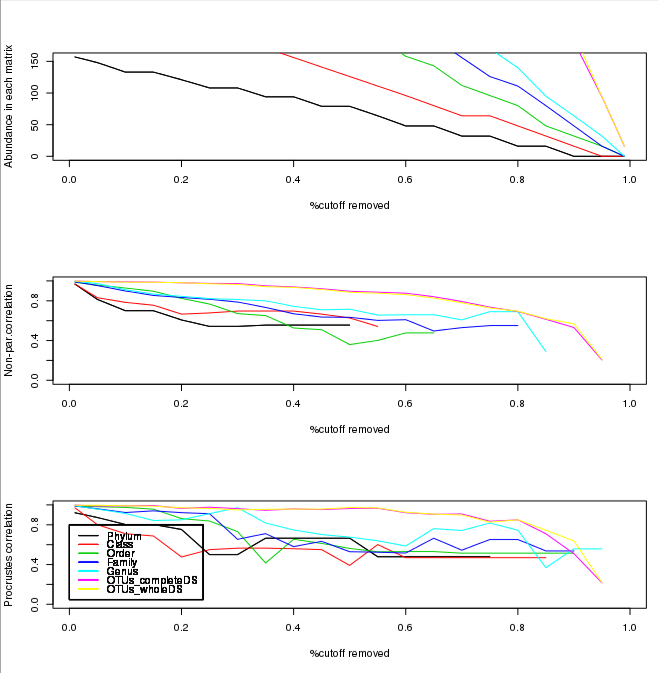
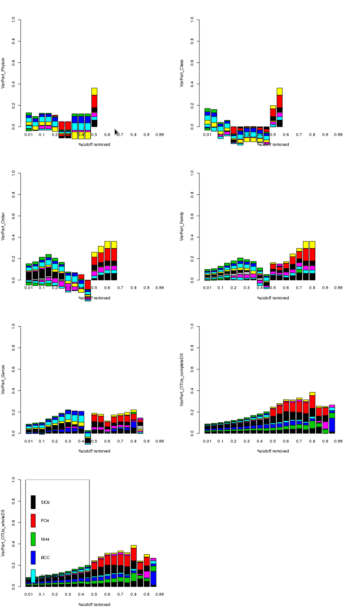

==============================================
Multivariate Cutoff Level Analysis (MultiCoLA)
==============================================

Introduction
------------
Many microbiological studies have a problem with `rare` sequences in the raw data. The problem is: how do you define rare? Are the rare sequences organic, or simply an artifact of the sequencer?  Do the rare sequences have an effect on your community? MultiCoLA is a proposed solution to this problem.  The idea is that you take your dataset with no rarity cutoff, then you apply increasingly rigorous rarity cutoffs.  You can then study the results to see where significat changes took place, and where the data becomes unpredictable. When preforming the rarity cutoffs the rare sequences are discarded. MultiCoLA allows the definition of OTU to be changed, you can say that if a sequence is off by one base it is in a new OTU, or they can be the same OTU if they are in the same phylum, class, ect.

Existing Implementations
------------------------
The only implementation seems to be by the authors who suggested this method.  The implementation is in R and is a collection of scripts rather than a all encompassing script.

System Setup and Required Dependencies
--------------------------------------

:note: The following instructions have been tested on 64-bit Fedora (essentially Redhat) using Python 2.7.2. However, they `should` work across different linux distros and on Macs. The instructions assume you use bash as your shell.

:download:`These <../downloads/MultiCoLA/MultiCoLA.1.3.zip>` are the MultiCoLA files I used, you may be able to get the .zip file off of the author's website ``www.ecology-research.com``, but when I did several of the files were outdated and had to be aquired via email.

Your system must have R installed, you can get R by running the command: ::

	yum install R
	
Then launch R by running the command: ::

	R

You should now be in the R console

Now install vegan and mass with the commands, this will take a long time: ::

	install.packages("vegan", dependencies=TRUE)
	install.packages("MASS", dependencies=TRUE) 

:note: vegan 2.0-3 was used, other versions may break functionality.
	
Useful commands
---------------
Change working directory to where the input files and scripts are: ::

        setwd("/home/aragorn/MultiCoLA.1.3")
	
Read and store input file in a variable: ::

	M<-read.table("input.txt",header=TRUE,row.names=1)
	
Load script(s): ::

	source("script.r")
	
Run script and store output in a variable: ::

	results<-script(M)
	
	
Our progress understanding MultiCoLA
------------------------------------
**Import all needed scripts and files:** ::

	M<-read.table("input.txt",header=TRUE,row.names=1)
	source("taxa.pooler.1.3.r")
	source("COtables.1.3.r")
        source("cutoff.impact.1.3.r")
        source("cutoff.impact.fig.1.3.r")
        ENV<-read.table("env.txt",header=TRUE,row.names=1)
        source("VP.COL.1.3.r")
        source("corrcoeff.ENV.1.3.r")
        source("signif.1.4.r")

**Ran the commands:** ::

	all_taxa_pooled<-taxa.pooler(M)
	
**Answered the questions:**

	Number of samples? (e.g. 16)... 16

	Number of taxonomic levels? (e.g. phylum+class+order+family+genus=5)... 5

	Presence/absence tables as output? (y/n) y

	Output as text files? (y/n)... y
	
**The following files were created:**
:download:`Phylum.matrix.txt <../downloads/MultiCoLA/Phylum.matrix.txt>`
:download:`Class.matrix.txt <../downloads/MultiCoLA/Class.matrix.txt>`	
:download:`Order.matrix.txt <../downloads/MultiCoLA/Order.matrix.txt>`
:download:`Family.matrix.txt <../downloads/MultiCoLA/Family.matrix.txt>`
:download:`Genus.matrix.txt <../downloads/MultiCoLA/Genus.matrix.txt>`
:download:`OTUs_completeDS.matrix.txt <../downloads/MultiCoLA/OTUs_completeDS.matrix.txt>`
:download:`OTUs_wholeDS.matrix.txt <../downloads/MultiCoLA/OTUs_wholeDS.matrix.txt>`

**Ran the commands:** ::

        truncated.DS.phylum<-COtables(all_taxa_pooled[[1]], Type="ADS",typem="dominant")
        truncated.DS.class<-COtables(all_taxa_pooled[[2]], Type="ADS",typem="dominant")
        truncated.DS.order<-COtables(all_taxa_pooled[[3]], Type="ADS",typem="dominant")
        truncated.DS.family<-COtables(all_taxa_pooled[[4]], Type="ADS",typem="dominant")
        truncated.DS.genus<-COtables(all_taxa_pooled[[5]], Type="ADS",typem="dominant")
        truncated.DS.OTUcompleteDS<-COtables(all_taxa_pooled[[6]], Type="ADS",typem="dominant")
        truncated.DS.OTUwholeDS<-COtables(all_taxa_pooled[[7]], Type="ADS",typem="dominant")
        corr.all<-cutoff.impact(all_taxa_pooled,Type="ADS",corcoef="spearman",typem="dominant")

**Answered the question:**

        Details of the NMDS calculations? (y/n)...      n

**Was warned:**

        There were 50 or more warnings (use warnings() to see the first 50)
        
**Ran the commands:** ::

        output.all<-cutoff.impact.fig(corr.all)

**Answered the questions:**

        Output as text files? (y/n)...  y

        Plot the results? (y/n)...      y

**The files were created:**
:download:`abundance.txt <../downloads/MultiCoLA/abundance.txt>`
:download:`non-par.correlation.txt <../downloads/MultiCoLA/non-par.correlation.txt>`
:download:`procrustes.txt <../downloads/MultiCoLA/procrustes.txt>`

**This graph was displayed:**

**Ran the command:** ::

        VP.1.taxa<-VP.COL(all_taxa_pooled,ENV,Type="ADS")

**Answered the questions:**

        Output as text files? (y/n)...  y

        Plot the results? (y/n)...      y
 
**The files were created:**
:download:`Phylum.sum.adjRsq.txt <../downloads/MultiCoLA/Phylum.sum.adjRsq.txt>`
:download:`Phylum.VarPart.txt <../downloads/MultiCoLA/Phylum.VarPart.txt>`
:download:`Class.sum.adjRsq.txt <../downloads/MultiCoLA/Class.sum.adjRsq.txt>`
:download:`Class.VarPart.txt <../downloads/MultiCoLA/Class.VarPart.txt>`
:download:`Order.sum.adjRsq.txt <../downloads/MultiCoLA/Order.sum.adjRsq.txt>`
:download:`Order.VarPart.txt <../downloads/MultiCoLA/Order.VarPart.txt>`
:download:`Family.sum.adjRsq.txt <../downloads/MultiCoLA/Family.sum.adjRsq.txt>`
:download:`Family.VarPart.txt <../downloads/MultiCoLA/Family.VarPart.txt>`
:download:`Genus.sum.adjRsq.txt <../downloads/MultiCoLA/Genus.sum.adjRsq.txt>`
:download:`Genus.VarPart.txt <../downloads/MultiCoLA/Genus.VarPart.txt>`
:download:`OTUs_completeDS.sum.adjRsq.txt <../downloads/MultiCoLA/OTUs_completeDS.sum.adjRsq.txt>`
:download:`OTUs_completeDS.VarPart.txt <../downloads/MultiCoLA/OTUs_completeDS.VarPart.txt>`
:download:`OTUs_wholeDS.matrix.txt <../downloads/MultiCoLA/OTUs_wholeDS.matrix.txt>`
:download:`OTUs_wholeDS.sum.adjRsq.txt <../downloads/MultiCoLA/OTUs_wholeDS.sum.adjRsq.txt>`

**This graph was displayed:**

**Ran the commands:** ::
        
        corrcoeff.table.ADS<-matrix(NA,21,5)
        row.names(corrcoeff.table.ADS)<-c(paste("CO_",c(0.01,seq(0.05,0.95,by=0.05),0.99),sep=""))
        colnames(corrcoeff.table.ADS)<-c("Sum",paste("RDA1.",colnames(ENV),sep=""))
        OTU.ADS<-VP.1.taxa[[c(7,3)]]
        SPE<-OTU.ADS[[1]];corrcoeff.table.ADS[1,]<-corrcoeff(SPE,ENV);rm(SPE)
        SPE<-OTU.ADS[[2]];corrcoeff.table.ADS[2,]<-corrcoeff(SPE,ENV);rm(SPE)
        SPE<-OTU.ADS[[3]];corrcoeff.table.ADS[3,]<-corrcoeff(SPE,ENV);rm(SPE)
        SPE<-OTU.ADS[[4]];corrcoeff.table.ADS[4,]<-corrcoeff(SPE,ENV);rm(SPE)
        SPE<-OTU.ADS[[5]];corrcoeff.table.ADS[5,]<-corrcoeff(SPE,ENV);rm(SPE)
        SPE<-OTU.ADS[[6]];corrcoeff.table.ADS[6,]<-corrcoeff(SPE,ENV);rm(SPE)
        SPE<-OTU.ADS[[6]];corrcoeff.table.ADS[7,]<-corrcoeff(SPE,ENV);rm(SPE)
        SPE<-OTU.ADS[[7]];corrcoeff.table.ADS[8,]<-corrcoeff(SPE,ENV);rm(SPE)
        SPE<-OTU.ADS[[8]];corrcoeff.table.ADS[9,]<-corrcoeff(SPE,ENV);rm(SPE)
        SPE<-OTU.ADS[[9]];corrcoeff.table.ADS[10,]<-corrcoeff(SPE,ENV);rm(SPE)
        SPE<-OTU.ADS[[10]];corrcoeff.table.ADS[11,]<-corrcoeff(SPE,ENV);rm(SPE)
        SPE<-OTU.ADS[[11]];corrcoeff.table.ADS[12,]<-corrcoeff(SPE,ENV);rm(SPE)
        SPE<-OTU.ADS[[13]];corrcoeff.table.ADS[13,]<-corrcoeff(SPE,ENV);rm(SPE)
        SPE<-OTU.ADS[[14]];corrcoeff.table.ADS[14,]<-corrcoeff(SPE,ENV);rm(SPE)
        SPE<-OTU.ADS[[15]];corrcoeff.table.ADS[15,]<-corrcoeff(SPE,ENV);rm(SPE)
        SPE<-OTU.ADS[[16]];corrcoeff.table.ADS[16,]<-corrcoeff(SPE,ENV);rm(SPE)
        SPE<-OTU.ADS[[17]];corrcoeff.table.ADS[17,]<-corrcoeff(SPE,ENV);rm(SPE)
        SPE<-OTU.ADS[[18]];corrcoeff.table.ADS[18,]<-corrcoeff(SPE,ENV);rm(SPE)
        SPE<-OTU.ADS[[19]];corrcoeff.table.ADS[19,]<-corrcoeff(SPE,ENV);rm(SPE)
        SPE<-OTU.ADS[[20]];corrcoeff.table.ADS[20,]<-corrcoeff(SPE,ENV);rm(SPE)
        SPE<-OTU.ADS[[21]];corrcoeff.table.ADS[21,]<-corrcoeff(SPE,ENV);rm(SPE)
        SPE<-all_taxa_pooled[[7]]
        corrcoeff.table.ADS.orig<-corrcoeff(SPE,ENV)
        row.names(corrcoeff.table.ADS.orig)<-c("CO_1")
        corrcoeff.table.ADS<-rbind(corrcoeff.table.ADS,corrcoeff.table.ADS.orig)
        write.table(corrcoeff.table.ADS,"corrcoeff.table.ADS.txt",quote=FALSE)

**The file was created:**
:download:`corrcoeff.table.ADS.txt <../downloads/MultiCoLA/corrcoeff.table.ADS.txt>`

**Ran the commands:** ::

        signif.table.ADS<-matrix(NA,21,5)
        row.names(signif.table.ADS)<-c(paste("CO_",c(0.01,seq(0.05,0.95,by=0.05),0.99),sep=""))
        colnames(signif.table.ADS)<- c("whole.sig","ENV1.sig","ENV2.sig","ENV3.sig","ENV4.sig")
        OTU.ADS<-VP.1.taxa[[c(7,3)]]
        SPE<-OTU.ADS[[1]];signif.table.ADS[1,]<-signif(SPE,ENV);rm(SPE)
        SPE<-OTU.ADS[[2]];signif.table.ADS[2,]<-signif(SPE,ENV);rm(SPE)
        SPE<-OTU.ADS[[3]];signif.table.ADS[3,]<-signif(SPE,ENV);rm(SPE)
        SPE<-OTU.ADS[[4]];signif.table.ADS[4,]<-signif(SPE,ENV);rm(SPE)
        SPE<-OTU.ADS[[5]];signif.table.ADS[5,]<-signif(SPE,ENV);rm(SPE)
        SPE<-OTU.ADS[[6]];signif.table.ADS[6,]<-signif(SPE,ENV);rm(SPE)
        SPE<-OTU.ADS[[7]];signif.table.ADS[7,]<-signif(SPE,ENV);rm(SPE)
        SPE<-OTU.ADS[[8]];signif.table.ADS[8,]<-signif(SPE,ENV);rm(SPE)
        SPE<-OTU.ADS[[9]];signif.table.ADS[9,]<-signif(SPE,ENV);rm(SPE)
        SPE<-OTU.ADS[[10]];signif.table.ADS[10,]<-signif(SPE,ENV);rm(SPE)
        SPE<-OTU.ADS[[11]];signif.table.ADS[11,]<-signif(SPE,ENV);rm(SPE)
        SPE<-OTU.ADS[[12]];signif.table.ADS[12,]<-signif(SPE,ENV);rm(SPE)
        SPE<-OTU.ADS[[13]];signif.table.ADS[13,]<-signif(SPE,ENV);rm(SPE)
        SPE<-OTU.ADS[[14]];signif.table.ADS[14,]<-signif(SPE,ENV);rm(SPE)
        SPE<-OTU.ADS[[15]];signif.table.ADS[15,]<-signif(SPE,ENV);rm(SPE)
        SPE<-OTU.ADS[[16]];signif.table.ADS[16,]<-signif(SPE,ENV);rm(SPE)
        SPE<-OTU.ADS[[17]];signif.table.ADS[17,]<-signif(SPE,ENV);rm(SPE)
        SPE<-OTU.ADS[[18]];signif.table.ADS[18,]<-signif(SPE,ENV);rm(SPE)
        SPE<-OTU.ADS[[19]];signif.table.ADS[19,]<-signif(SPE,ENV);rm(SPE)
        SPE<-OTU.ADS[[20]];signif.table.ADS[20,]<-signif(SPE,ENV);rm(SPE)
        SPE<-OTU.ADS[[21]];signif.table.ADS[21,]<-signif(SPE,ENV);rm(SPE)
        SPE<-all_taxa_pooled[[7]]
        signif.table.ADS.orig<-signif(SPE,ENV)
        row.names(signif.table.ADS.orig)<-c("CO_1")
        signif.table.ADS<-rbind(signif.table.ADS, signif.table.ADS.orig)
        write.table(signif.table.ADS,"signif.table.ADS.txt",quote=FALSE)

**The file was created:**
:download:`signif.table.ADS.txt <../downloads/MultiCoLA/signif.table.ADS.txt>`

**Reached the end of the manual:**
        Trying to find out what the results mean, and how to use this with our datasets.
        It looks like OTU_table has the same format as input.txt
        map.txt might be the same as env.txt

Input Files
-----------

Output Files
------------

Testing Results
---------------
This section will describe different tests that were run on the MultiCoLA script.
These tests will use empirical data from one of the several datasets that the
team has access to. These data files will not be included for download due to
their (usually) large size. Unless otherwise noted, the data files that were
used can be found under the datasets directory.

Glen Caynon Attempt
^^^^^^^^^^^^^^^^^^^
**Description:**

This is where we explore running MultiCoLA with QIIME files.

:download:`convert_otu <../downloads/MultiCoLA/convert_otu>` is used in this part
        
Run the commands ::

        ./convert_otu otu_table_even17340.txt 100

        R

        setwd("/home/aragorn/bio/microbiogeo/r/MCT/glen_canyon")

        M<-read.table("otu_table_even17340.txt",header=TRUE,row.names=1)
        ENV<-read.table("map_25Jan2012.txt",header=TRUE,row.names=1)
        
        source("../taxa.pooler.1.3.r")
        source("../COtables.1.3.r")
        source("../cutoff.impact.1.3.r")
        source("../cutoff.impact.fig.1.3.r")
        source("../VP.COL.1.3.r")
        source("../corrcoeff.ENV.1.3.r")
        source("../signif.1.4.r")
        
        all_taxa_pooled<-taxa.pooler(M)
	
**Answered the questions:**

	Number of samples? (e.g. 16)... 94(columns-taxonomic levels)

	Number of taxonomic levels? (e.g. phylum+class+order+family+genus=5)... 5

	Presence/absence tables as output? (y/n) y

	Output as text files? (y/n)... y
	
**The following files were created:**
:download:`Phylum.matrix.txt <../downloads/MultiCoLA/gPhylum.matrix.txt>`
:download:`Class.matrix.txt <../downloads/MultiCoLA/gClass.matrix.txt>`	
:download:`Order.matrix.txt <../downloads/MultiCoLA/gOrder.matrix.txt>`
:download:`Family.matrix.txt <../downloads/MultiCoLA/gFamily.matrix.txt>`
:download:`Genus.matrix.txt <../downloads/MultiCoLA/gGenus.matrix.txt>`
:download:`OTUs_completeDS.matrix.txt <../downloads/MultiCoLA/gOTUs_completeDS.matrix.txt>`
:download:`OTUs_wholeDS.matrix.txt <../downloads/MultiCoLA/gOTUs_wholeDS.matrix.txt>`

References
----------
