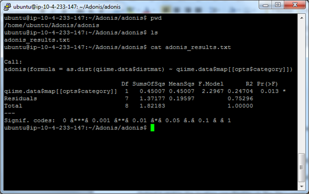
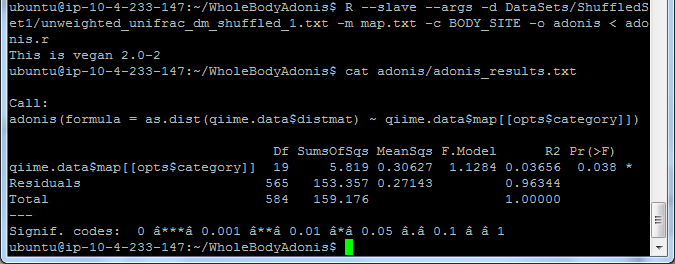
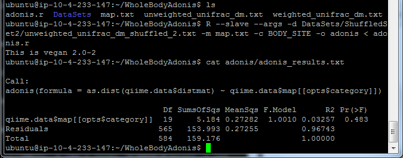
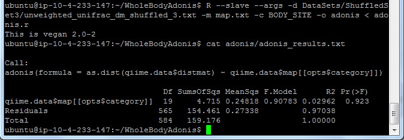
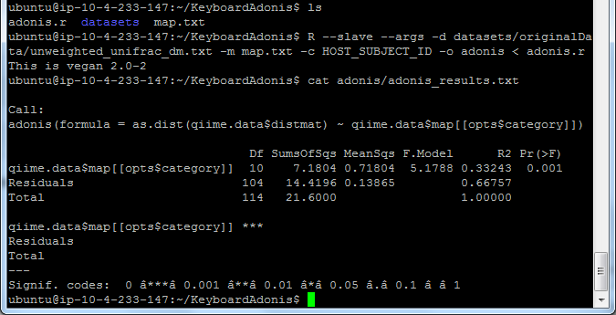
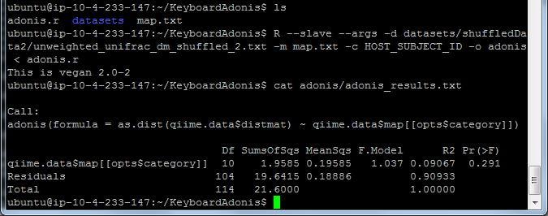
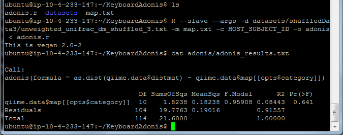
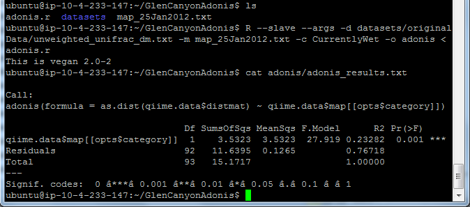
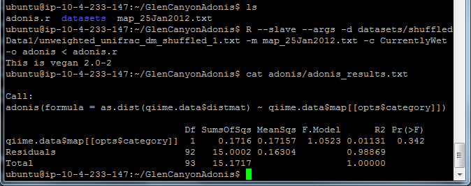
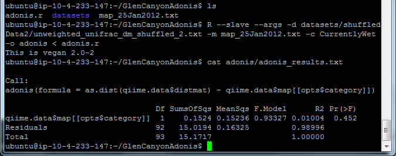

.. _adonisstartref:

======
Adonis
======

Introduction
------------

Adonis is a statistical method that operates in the same manner that Permutational Multivariate Analysis of Variance(Permanova) does. Adonis is essentially the same thing, except it uses distance matrices. Because it is a variation of Permanova, the way which it handles the information passed in is similar.

This has been called a "nonparemetric manova". To elaborate on what is being said, this variation of the method does not make the same assumptions as MANOVA does. As such it may not determine the same information with the same accuracy.

The primary input that this method is concerned with, is receiving a formula. From there the data that is passed in is used in conjunction with the formula to calculate the desired information.

Existing Implementations
------------------------

Selected Implementation
^^^^^^^^^^^^^^^^^^^^^^^

The implementation being used is from the R software package called Vegan. The documentation explicitly lists this as "Permutational Multivariate Analysis of Variance Using Distance Matrices". It is also stated to be non-parametric.

The website can be found `here <http://vegan.r-forge.r-project.org/>`__

The selected implementations documentation can be found `here <http://cc.oulu.fi/~jarioksa/softhelp/vegan/html/adonis.html>`__. :ref:`[1] <adonisref1>`

Alternative Implementations
^^^^^^^^^^^^^^^^^^^^^^^^^^^

Outside of the selected implementation there were no other alternatives to this method found.

An issue that was discovered while researching this is that there appears to be more documentation that is not related to the orginal site that the original documentation was located on.

This alternative can be found `here <http://rss.acs.unt.edu/Rdoc/library/vegan/html/adonis.html>`_.

The documentation for the selected implementation and the above implementation are virtually the same and no indication is given that there is a distinct difference between the two. The only difference is that the alternative implementation lists it as a version that is not permutational. This leads me to believe that there is no difference and somehow I stumbled upon an alternate form of the documentation, hosted by someone else.

System Setup and Required Dependencies
--------------------------------------
Step 1:
The first step is to install R. The following command downloads and installs R:

    sudo apt-get install r-base

Step 2:
Identify the qiime location for where it is installed. In the case of the AWS, using AMI:QIIME 1.4.0 EBS East (ami-458d5b2c). 

	QIIME location is: /software/qiime-1.4.0-release

Step 3:
You need to define an environment variable to tell the script where to look for the r utility functions in qiime. Run the following command, changing the path to point to the location of your qiime install:

    export qiime_dir=/home/<username>/qiime/trunk

If you dont want to have to perform this step each time you open a new terminal, run the following command to add it to your .bashrc:

    echo "export qiime_dir=/home/<username>/qiime/trunk" >> ~/.bashrc
    source ~/.bashrc

OR

Go into /etc/, and open the file /etc/environment. In this file youll want to put the line:

	QIIME_DIR="/software/qiime-1.4.0-release" 

The full information is:

	Directory: /etc/
	File: environment
	Full file path: /etc/environment
	String to add at bottom: QIIME_DIR="/software/qiime-1.4.0-release" 

Make sure to include the quotes. Once you do that you need to save and  restart. 

After all of this you can now type "echo $QIIME_DIR" in the terminal and it should print out the set path that was used above..

Step 4:
Youll need to install some R packages. If you can use the R console from the command line simply type R to get to it.

To get the packages type:
	install.packages(optparse)
	install.packages(vegan)

If youre concerned about updating packages type "update.packages()" in the R console, excluding the quotes.

Input Files
-----------
The method call from the R software package that is used with this script is:

``adonis(formula, data, permutations = 999, method = "bray", strata = NULL, contr.unordered = "contr.sum", contr.ordered = "contr.poly", ...)``

Formula - This represents what the data is going to be fit to
Data - This is the data being used for this method
Permutations - This is the number of replications used for hypothesis tests.
Method - The specified manner in which pair wise distances are calculated
Strata - This groups the permutations based on the specified strata

From the command line type: ::

  R --slave --args -d distanceMatrix.txt -m Fasting_Map.txt -c Treatment -o adonis < adonis.r

REQUIRED script options:
The following options must be provided under all circumstances.

``--slave``
    Make R run as quietly as possible. This option is intended to support programs which use R to compute results for them. It implies --quiet and --no-save. 

``--args``
    This flag does nothing except cause the rest of the command line to be skipped: this can be useful to retrieve values from it with commandArgs(TRUE).

``-i OR --input_path = INPUT_PATH``
	path to the input distance matrix file(s) (i.e., the output from beta_diversity.py).

``-o OR --output_path = OUTPUT_PATH``
	output path to the name of a single file

``-m OR --map_path = MAP_PATH``
	path to the location of the mapping file

``-c CATEGORY, --category=CATEGORY``
	String which coresponds to the column name containing grouping info

Output Files
------------
The output for adonis is in a directory specified by the -o parameter. The results should be labeled "adonis_results.txt".

Upon opening the file its output will read something similar to

 ::

  Call:
  adonis(formula = as.dist(qiime.data$distmat) ~ qiime.data$map[[opts$category]])

                                Df SumsOfSqs MeanSqs F.Model      R2 Pr(>F)
  qiime.data$map[[opts$category]]  1   0.45007 0.45007  2.2967 0.24704  0.004 **
  Residuals                        7   1.37177 0.19597         0.75296
  Total                            8   1.82183                 1.00000

  Signif. codes:  0 0.001 0.01 0.05 0.1 1

I have no idea what this output means.
  

Testing Results
---------------

Testing will need to be worked on further. Once I can figure out how to verify the ouput that is received I can start checking the information using tests.

QIIME Overview Test
^^^^^^^^^^^^^^^^^^^
**Description:**

This was the initial test performed with the QIIME overview data in order to identify expected functionality and output.

**Input**

The input being analyzed is specified by -d, -m.

  - d represent the distance matrice being supplied. 

  - m represents the Fasting map, where samples and their information are provided.

  - c specifies what information of the input you are analyzing. In the case of the QIIME over view files the parameter passed in was the Treatment category. The columns in that file are half Control and the other half are Fast.

**Command** ::

  R --slave --args -d overview_unweighted_unifrac_dm.txt -m Fasting_Map.txt -c Treatment -o adonis < adonis.r

**Results**

Initial testing was performed using data provided by the QIIME tutorial. The files were: 

 * Fasting_Map.txt
 * overview_unweighted_unifrac_dm.txt

Output is sent to the location specified by -o. The files name should be adonis_results.txt opening it should provide you with the information output:

Whole Body (Clustering)
^^^^^^^^^^^^^^^^^^^^^^^

The data files used for this testing can be found :download:`here <../downloads/WholeBodyAdonisRtesting.zip>`

In order to reproduce the results extract the files and folders, then navigate to the root directory of the extracted files and run the commands that are listed for each test.

Body Site Analysis (Original Data - BODY_SITE)
~~~~~~~~~~~~~~~~~~~~~~~~~~~~~~~~~~~~~~~~~~~~~~
**Description:**

This test uses the `BODY_SITE` category as a positive control.
We expect there to be significant clustering due to previous analysis done on
the Whole Body dataset.

**Input:** ::

  The files provided are:

  Mapping File:
  \QiimeUtilsRepository\microbiogeo\datasets\whole_body\map.txt

  Distance Matix:
  \QiimeUtilsRepository\microbiogeo\datasets\whole_body\unweighted_unifrac_dm.txt

**Command:** ::
 
  R --slave --args -d unweighted_unifrac_dm.txt -m map.txt -c BODY_SITE -o adonis < adonis.r

**Results:**

.. image:: ../images/adonis/wholebody/originalData/bodysiteRun.png
  :align: center

Again output should be located in the adonis/adonis_results.txt

.. image:: ../images/adonis/wholebody/originalData/bodysiteChangeDir.png
  :align: center

When you cat it, or open the file the output created was:

.. image:: ../images/adonis/wholebody/originalData/bodysiteResults.png
  :align: center

TO DO:
Perform Analysis

Body Site Analysis (Shuffled Data 1 - BODY_SITE)
~~~~~~~~~~~~~~~~~~~~~~~~~~~~~~~~~~~~~~~~~~~~~~~~~
**Description:**

This test uses the `BODY_SITE` category as a negative control.

We expect there to be no significant clustering due to previous analysis done on
the Whole Body dataset.

**Input:**

The files provided are: ::

  Mapping File:
  \QiimeUtilsRepository\microbiogeo\datasets\whole_body\map.txt

  Distance Matix:
  \QiimeUtilsRepository\microbiogeo\datasets\whole_body\unweighted_unifrac_dm_shuffled_1.txt

**Command:** ::

  R --slave --args -d DataSets/ShuffledSet1/unweighted_unifrac_dm_shuffled_1.txt -m map.txt -c BODY_SITE -o adonis < adonis.r

**Results:**

TO DO:
Perform Analysis

Body Site Analysis (Shuffled Data 2 - BODY_SITE)
~~~~~~~~~~~~~~~~~~~~~~~~~~~~~~~~~~~~~~~~~~~~~~~~~
**Description:**

This test uses the `BODY_SITE` category as a negative control.

We expect there to be no significant clustering due to previous analysis done on
the Whole Body dataset.

**Input:**

The files provided are: ::

  Mapping File:
  \QiimeUtilsRepository\microbiogeo\datasets\whole_body\map.txt

  Distance Matix:
  \QiimeUtilsRepository\microbiogeo\datasets\whole_body\unweighted_unifrac_dm_shuffled_2.txt

**Command:** ::

  R --slave --args -d DataSets/ShuffledSet2/unweighted_unifrac_dm_shuffled_2.txt -m map.txt -c BODY_SITE -o adonis < adonis.r

**Results:**

TO DO:
Perform Analysis

Body Site Analysis (Shuffled Data 3 - BODY_SITE)
~~~~~~~~~~~~~~~~~~~~~~~~~~~~~~~~~~~~~~~~~~~~~~~~~
**Description:**

This test uses the `BODY_SITE` category as a negative control.

We expect there to be no significant clustering due to previous analysis done on
the Whole Body dataset.

**Input:**

The files provided are: ::

  Mapping File:
  \QiimeUtilsRepository\microbiogeo\datasets\whole_body\map.txt

  Distance Matix:
  \QiimeUtilsRepository\microbiogeo\datasets\whole_body\unweighted_unifrac_dm_shuffled_3.txt

**Command:** ::

  R --slave --args -d DataSets/ShuffledSet3/unweighted_unifrac_dm_shuffled_3.txt -m map.txt -c BODY_SITE -o adonis < adonis.r

**Results:**

TO DO:
Perform Analysis

Body Site Analysis (Original Data - SEX)
~~~~~~~~~~~~~~~~~~~~~~~~~~~~~~~~~~~~~~~~
**Description:**

This test uses the `SEX` category as a positive control.
We expect there to be significant clustering due to previous analysis done on
the Whole Body dataset.

**Input:** ::

  The files provided are:

  Mapping File:
  \QiimeUtilsRepository\microbiogeo\datasets\whole_body\map.txt

  Distance Matix:
  \QiimeUtilsRepository\microbiogeo\datasets\whole_body\unweighted_unifrac_dm.txt

**Command:** ::

  R --slave --args -d unweighted_unifrac_dm.txt -m map.txt -c SEX -o adonis < adonis.r

**Results:**

.. image:: ../images/adonis/wholebody/originalData/sexResults.png
  :align: center

TO DO:
Perform Analysis

Keyboard (Clustering)
^^^^^^^^^^^^^^^^^^^^^

The data files used for this testing can be found :download:`here <../downloads/KeyboardAdonisRtesting.zip>`

In order to reproduce the results extract the files and folders, then navigate to the root directory of the extracted files and run the commands that are listed for each test.

Keyboard Analysis (Original Data - Host_Subject_ID)
~~~~~~~~~~~~~~~~~~~~~~~~~~~~~~~~~~~~~~~~~~~~~~~~~~~
**Description:**

These are the tests performed on the keyboard data set. It focuses on using the `Host_Subject_ID`. The expected result is to see results that cluster around the `Host_Subject_ID` information. This is being used as a positive correlation test.

**Input:**

The files provided are: ::

  Mapping File:
  \QiimeUtilsRepository\microbiogeo\datasets\keyboard\map.txt

  Distance Matix:
  \QiimeUtilsRepository\microbiogeo\datasets\keyboard\unweighted_unifrac_dm.txt

**Command:** ::

  R --slave --args -d datasets/originalData/unweighted_unifrac_dm.txt -m map.txt -c HOST_SUBJECT_ID -o adonis < adonis.r
  

**Results:**

TO DO:
Perform Analysis

Keyboard Analysis (Shuffled Data 1 - Host_Subject_ID)
~~~~~~~~~~~~~~~~~~~~~~~~~~~~~~~~~~~~~~~~~~~~~~~~~~~~~
**Description:**

These are the tests performed on the keyboard data set. It focuses on using the `Host_Subject_ID`. The expected result is to see results that are NOT clustering arounding the `Host_Subject_ID` information. This is being used as a negative correlation test.

**Input:**

The files provided are: ::

  Mapping File:
  \QiimeUtilsRepository\microbiogeo\datasets\keyboard\map.txt

  Distance Matix:
  \QiimeUtilsRepository\microbiogeo\datasets\keyboard\unweighted_unifrac_dm_shuffled_1.txt

**Command:** ::

  R --slave --args -d datasets/shuffledData1/unweighted_unifrac_dm_shuffled_1.txt -m map.txt -c HOST_SUBJECT_ID -o adonis < adonis.r
  

**Results:**

.. image:: ../images/adonis/keyboard/shuffledData1/hostSubjectIDResults.png
  :align: center

TO DO:
Perform Analysis

Keyboard Analysis (Shuffled Data 2 - Host_Subject_ID)
~~~~~~~~~~~~~~~~~~~~~~~~~~~~~~~~~~~~~~~~~~~~~~~~~~~~~
**Description:**

These are the tests performed on the keyboard data set. It focuses on using the `Host_Subject_ID`. The expected result is to see results that are NOT clustering arounding the `Host_Subject_ID` information. This is being used as a negative correlation test.

**Input:**

The files provided are: ::

  Mapping File:
  \QiimeUtilsRepository\microbiogeo\datasets\keyboard\map.txt

  Distance Matix:
  \QiimeUtilsRepository\microbiogeo\datasets\keyboard\unweighted_unifrac_dm_shuffled_2.txt

**Command:** ::

  R --slave --args -d datasets/shuffledData2/unweighted_unifrac_dm_shuffled_2.txt -m map.txt -c HOST_SUBJECT_ID -o adonis < adonis.r
  

**Results:**

TO DO:
Perform Analysis

Keyboard Analysis (Shuffled Data 3 - Host_Subject_ID)
~~~~~~~~~~~~~~~~~~~~~~~~~~~~~~~~~~~~~~~~~~~~~~~~~~~~~
**Description:**

These are the tests performed on the keyboard data set. It focuses on using the `Host_Subject_ID`. The expected result is to see results that are NOT clustering arounding the `Host_Subject_ID` information. This is being used as a negative correlation test.

**Input:**

The files provided are: ::

  Mapping File:
  \QiimeUtilsRepository\microbiogeo\datasets\keyboard\map.txt

  Distance Matix:
  \QiimeUtilsRepository\microbiogeo\datasets\keyboard\unweighted_unifrac_dm_shuffled_3.txt

**Command:** ::

  R --slave --args -d datasets/shuffledData3/unweighted_unifrac_dm_shuffled_3.txt -m map.txt -c HOST_SUBJECT_ID -o adonis < adonis.r

**Results:**

TO DO:
Perform Analysis

Glen Canyon (Clustering)
^^^^^^^^^^^^^^^^^^^^^^^^

The data files used for this testing can be found :download:`here <../downloads/GlenCanyonAdonisRtesting.zip>`

In order to reproduce the results extract the files and folders, then navigate to the root directory of the extracted files and run the commands that are listed for each test.

Glen Canyon Analysis (Original Data - CurrentlyWet)
~~~~~~~~~~~~~~~~~~~~~~~~~~~~~~~~~~~~~~~~~~~~~~~~~~~~~
**Description:**

These are the tests performed on the glen canyon data set. It focuses on using the `CurrentlyWet` information. The expected result is to see the output clustering around areas if it was wet, or not. This is being used as a positive correlation test.

**Input:**

The files provided are: ::

  Mapping File:
  \QiimeUtilsRepository\microbiogeo\datasets\glen_canyon\map_25Jan2012.txt

  Distance Matix:
  \QiimeUtilsRepository\microbiogeo\datasets\glen_canyon\unweighted_unifrac_dm.txt

**Command:** ::

  R --slave --args -d datasets/originalData/unweighted_unifrac_dm.txt -m map_25Jan2012.txt -c CurrentlyWet -o adonis < adonis.r

**Results:**

TO DO:
Perform Analysis

Glen Canyon Analysis (Shuffled Data 1 - CurrentlyWet)
~~~~~~~~~~~~~~~~~~~~~~~~~~~~~~~~~~~~~~~~~~~~~~~~~~~~~
**Description:**

These are the tests performed on the glen canyon data set. It focuses on using the `CurrentlyWet` information. The expected result is to see the output NOT clustering around areas if it was wet, or not wet. This is being used as a negative correlation test.

**Input:**

The files provided are: ::

  Mapping File:
  \QiimeUtilsRepository\microbiogeo\datasets\glen_canyon\map_25Jan2012.txt

  Distance Matix:
  \QiimeUtilsRepository\microbiogeo\datasets\glen_canyon\unweighted_unifrac_dm_shuffled_1.txt

**Command:** ::

  R --slave --args -d datasets/shuffledData1/unweighted_unifrac_dm_shuffled_1.txt -m map_25Jan2012.txt -c CurrentlyWet -o adonis < adonis.r

**Results:**

TO DO:
Perform Analysis

Glen Canyon Analysis (Shuffled Data 2 - CurrentlyWet)
~~~~~~~~~~~~~~~~~~~~~~~~~~~~~~~~~~~~~~~~~~~~~~~~~~~~~
**Description:**

These are the tests performed on the glen canyon data set. It focuses on using the `CurrentlyWet` information. The expected result is to see the output NOT clustering around areas if it was wet, or not wet. This is being used as a negative correlation test.

**Input:**

The files provided are: ::

  Mapping File:
  \QiimeUtilsRepository\microbiogeo\datasets\glen_canyon\map_25Jan2012.txt

  Distance Matix:
  \QiimeUtilsRepository\microbiogeo\datasets\glen_canyon\unweighted_unifrac_dm_shuffled_2.txt

**Command:** ::

  R --slave --args -d datasets/shuffledData2/unweighted_unifrac_dm_shuffled_2.txt -m map_25Jan2012.txt -c CurrentlyWet -o adonis < adonis.r

**Results:**

TO DO:
Perform Analysis

Glen Canyon Analysis (Shuffled Data 3 - CurrentlyWet)
~~~~~~~~~~~~~~~~~~~~~~~~~~~~~~~~~~~~~~~~~~~~~~~~~~~~~
**Description:**

These are the tests performed on the glen canyon data set. It focuses on using the `CurrentlyWet` information. The expected result is to see the output NOT clustering around areas if it was wet, or not wet. This is being used as a negative correlation test.

**Input:**

The files provided are: ::

  Mapping File:
  \QiimeUtilsRepository\microbiogeo\datasets\glen_canyon\map_25Jan2012.txt

  Distance Matix:
  \QiimeUtilsRepository\microbiogeo\datasets\glen_canyon\unweighted_unifrac_dm_shuffled_3.txt

**Command:** ::

  R --slave --args -d datasets/shuffledData3/unweighted_unifrac_dm_shuffled_3.txt -m map_25Jan2012.txt -c CurrentlyWet -o adonis < adonis.r

**Results:**

.. image:: ../images/adonis/glencanyon/shuffledData3/currentlyWetResults.png
  :align: center

TO DO:
Perform Analysis

References
----------
.. _adonisref1:

[1]Permutational Multivariate Analysis of Variance Using Distance Matrices

http://cc.oulu.fi/~jarioksa/softhelp/vegan/html/adonis.html

.. _adonisref2:

[2]Vegdist Documentation

http://cc.oulu.fi/~jarioksa/softhelp/vegan/html/vegdist.html

.. _adonisref3:

[3]Alternate Adonis Documentation

http://www.oga-lab.net/RGM2/func.php?rd_id=vegan:adonis

