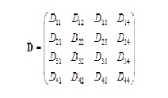

.. _anosim:

==============================================================
Analysis of Similarities (ANOSIM) Statistical Method Reference
==============================================================

Introduction
------------
The Analysis of Similarities (ANOSIM) method tests for clusters by computing an
R statistic, which is based on mean ranks of within group and between group
dissimilarities, scaled into the range −1...+1. It is a non-parametric variant
of Analysis of Variance (ANOVA). This method operates on a distance matrix using
a given grouping of samples.

The R statistic that is calculated by ANOSIM is determined by the following
formula:

R = (rb-rw)/(N(N-1)/4)

where rb is the mean rank of all distances between groups and rw is the mean
rank of all distances within groups. An R value near +1 means
that there is dissimilarity between the groups [:ref:`2 <ref2>`].

The original paper referencing ANOSIM is a paper by K.R. Clarke
[:ref:`3 <ref3>`]. Here is a helpful description taken from [:ref:`1 <ref1>`]:

The ANOSIM (Analysis of similarities) permutation method allows for testing for
group structure in the observations. If the original data contains abundance of
M species measured at N sites, an N – by – N matrix of (dis-)similarities D is
calculated. Suppose that the observations are from four different transects. As
a result, the matrix D contains a block structure:

 
The sub-matrices Dii represent the (dis-)similarities between observations of
the same transect, and Dij between observations of different transects. A
statistic based on both the between and within sub-matrices is used to test the
differences among the 4 groups. Further details can be found in Legendre and
Legendre (1998), or in Chapter 10 of Zuur et al. (2007). A p-value for the
statistic is obtained by permutation. To tell Brodgar which samples belong to
the same group, a nominal variable needs to be selected as the blocking
variable. ANOSIM can only be applied if "Association between samples" is
selected. ANOSIM can be applied on 1-way data, 2-way nested data, 2-way crossed
data with replication and 2-way crossed data with no replication.

.. _existingimplementations:

Existing Implementations
------------------------
There are several existing implementations of ANOSIM in statistical packages
that include:

* vegan package for R

* PERMANOVA add-in for PRIMER

* Fathom Toolbox for Matlab

* Brodgar

* possibly others...

ANOSIM has already been implemented in Python by Andrew Cochran but has not yet
been added to QIIME. The implementation has been checked into the Qiimeutils
repository under :file:`microbiogeo/python/`. The following sections of the
document will explain how to run Andrew's implementation of ANOSIM.

.. _setup:

System Setup and Required Dependencies
--------------------------------------

:note: The following instructions have been tested on 64-bit Linux Mint (essentially Debian) using Python 2.6.7. However, they `should` work across different linux distros and on Macs. The instructions assume you use bash as your shell.

First, your system must have a version of QIIME installed (I used the latest
version of QIIME in SVN). The code also depends on NumPy, though this should
already be installed if you have QIIME installed. Next, you must add the area
where Andrew's code resides to your PYTHONPATH environment variable, changing
the path to point to the location of the microbiogeo checkout on your machine. I
also added the scripts area to my PATH for convenience: ::

    export PYTHONPATH=/home/jrideout/qiime/qiimeutils/microbiogeo:$PYTHONPATH
    export PATH=/home/jrideout/qiime/qiimeutils/microbiogeo/python/scripts:$PATH

If you don't want to have to perform this step each time you open a new
terminal, run the following command to add the path to your .bashrc: ::

    echo "export PYTHONPATH=/home/jrideout/qiime/qiimeutils/microbiogeo:$PYTHONPATH" >> ~/.bashrc
    echo "export PATH=/home/jrideout/qiime/qiimeutils/microbiogeo/python/scripts:$PATH" >> ~/.bashrc
    source ~/.bashrc

Next, run the following command to test if you can run the ANOSIM script: ::

    anosim.py -h

This should run the script in "help" mode. If instructions for how to run the
script are printed, you have successfully configured your system.

.. _inputfiles:

Input Files
-----------
The ANOSIM script requires a distance matrix file (i.e. the result of
beta_diversity.py) and a metadata mapping file. I used the unweighted Unifrac
distance matrix from the QIIME overview tutorial. You can get the distance
matrix :download:`here <../downloads/overview_unweighted_unifrac_dm.txt>` and
the mapping file :download:`here <../downloads/Fasting_Map.txt>`.

Next, run the following command to execute the ANOSIM script: ::

    anosim.py -i overview_unweighted_unifrac_dm.txt -m Fasting_Map.txt -c Treatment -o anosim_results.txt

The -c option specifies which column in the mapping file will be used to group
the samples. The `Treatment` column has two values: 'Control' and 'Fast'. Thus,
ANOSIM will be used to calculate the dissimilarity between the control and fast
groups. The -o option specifies the file that we want the results written to.

.. _outputfiles:

Output Files
------------
The command in the previous section creates a single output file named
:file:`anosim_results.txt`. The resulting file should look like this: ::

    Input_filepath  ANOSIM_R_value  p_value
    overview_unweighted_unifrac_dm.txt      0.8125  NA

The first field lists the distance matrix file that was used as input. The
second field lists the R statistic that was computed (remember that this is the
primary output of ANOSIM). The final field lists the p-value, which is NA
because we did not specify the optional -p parameter (by default, the number of
p-trials is 0).

The value of the R statistic can fall between -1 and +1, with a positive value
close to 1 indicating that the groups are highly dissimilar. Thus, in this
example, the control and fast groups are dissimilar.

References
----------
.. _ref1:

[1] http://www.brodgar.com/manual/Chapter6BMS.pdf

.. _ref2:

[2] http://folk.uio.no/ohammer/past/multivar.html

.. _ref3:

[3] Clarke, K.R. 1993. Non-parametric multivariate analysis of changes in community structure. Australian Journal of Ecology 18:117-143.
