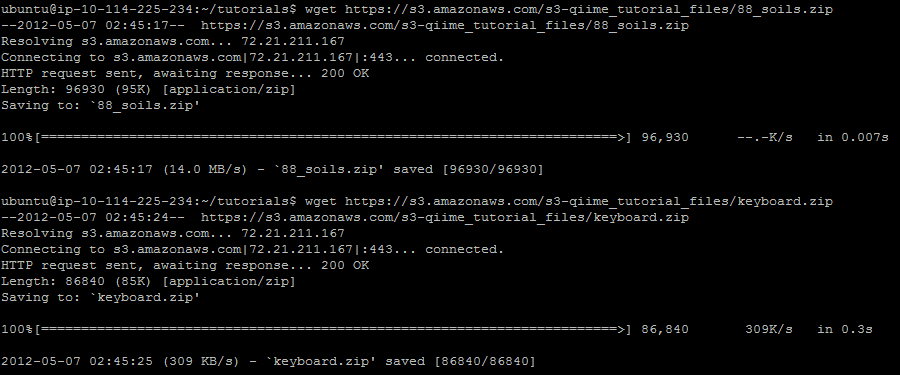
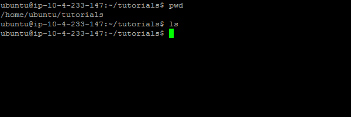
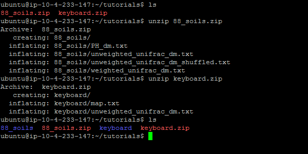
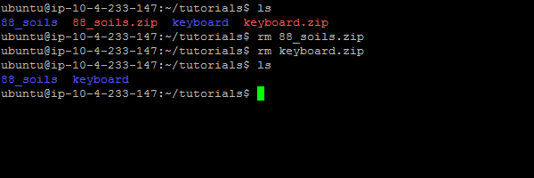
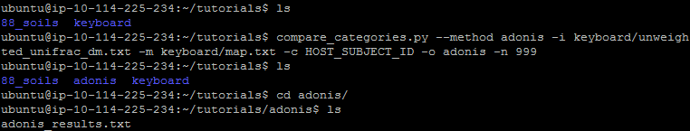
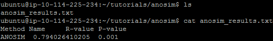

.. _category_comparison_tutorial:

=====================================
Comparing Sample Variable Categories
=====================================

Introduction
------------

This tutorial explains the use of several different mapping file category comparison techniques that are available in `compare_categories.py <../scripts/compare_categories.html>`_. A majority of the currently available comparison techniques are based on the ANOVA family of statistics, which is a statistical method, wherein observed variance in a particular variable is partitioned into components attributable to different sources of variation.

One common request when working with sample data is the ability to analyze the data sets with available statistical methods in the field. `compare_categories.py <../scripts/compare_categories.html>`_ provides this functionality. This tutorial will demonstrate how to work with this script in order to anaylze your data sets that have been produced through QIIME's workflow processing.

Input Files
-----------

Two data sets have been provided in order to demonstrate the proper use of this script. The information from these data sets were generated from QIIMEs OTU picking script(pick_otus_through_otu_table.py[ADD LINK HERE]). The first set is colloquially known as '88_soils', and the second is known as 'keyboard'.

The '88_Soils' files used in this tutorial can be found here[ADD THE LINK HERE].

The files are taken from a study (Lauber et al., 2009) where 88 soil samples were collected at various regions around the world. pH was recorded for each of the soil samples. Using distance_matrix_from_mapping.py, we created a distance matrix containing differences in pH between each pair of samples. Throughout this tutorial, we will explore various ways of comparing these matrices for correlation.

The 'keyboard' files used in this tutorial can be found here[ADD THE LINK HERE].

The files are taken from the (Fierier Keyboard study title goes here) study (Fiere citation goes here). In this study they sampled the microbial communities of people who used the same keyboard. Then they sampled the keyboard that the users shared, and identified that microbial communities would actually cluster around their respective hosts when processed. Thus, this provides a tenative application for forensics.

Output Files
------------

Depending on which statistical method you run, the output file(s) generated by this script will vary. They will all be placed in the directory specified by the required -o option. Most of the output files will be tab-separated text files containing information about the test that was performed and its results. These can easily be viewed in a spreadsheet program such as Microsoft Office: Excel.

Running the Help Command
------------------------

Lastly, if you're confused about the information that can be used with compare_categories.py[ADD LINK HERE], you can go ahead and type: ::
  
  compare_categories.py -h

This will display a brief overview of the script, as well as a more thorough explanation of each statistical method further below the initial information. It will also display usage script examples, as well explaining the output that should be expected upon successful completion of the project.

Pre-configuration
-----------------

In order to guarantee that your output is consistent with what is demonstrated in this tutorial you should download the two data sets above. This can be done by typing the following two commands: ::

  wget https://s3.amazonaws.com/s3-qiime_tutorial_files/keyboard.zip

  wget https://s3.amazonaws.com/s3-qiime_tutorial_files/88_soils.zip

This is demonstrated by the image below:

Then extract the contents to their default locations. All commands will be typed as though you are working in the directory that contains these extracted data sets.

Below is an image that demonstrates the basic environment with a tutorial directory that was created to house the two data sets.

To extract the contents of these .zip files type the commands: ::

  'unzip 88_soils.zip'

  'unzip keyboard.zip'

Below is an image that demonstrates how to extract the contents, and then displays the resulting two directories that are extracted from that process. 

After that if you feel confident in removing the .zip files that remain go ahead and do so. The below image demonstrates that process. The commands to do so are: ::

  'rm 88_soils.zip'

  'rm keyboard.zip'

Adonis
------

Adonis takes a set of sample data provided, and based on the metada information you can determine how related the categorical data is between the other samples. IE is there a relationship between the gender of the samples that were taken, or possibly the pH value of the samples that were taken.

To demonstrate this process we will use the keyboard data set found above. 

The command to run 'Adonis' will be: ::
  
  compare_categories.py --method adonis -i keyboard/unweighted_unifrac_dm.txt -m keyboard/map.txt -c HOST_SUBJECT_ID -o adonis - n 999

When broken down the command sytanx means this: ::

  compare_categories.py - This is the script being run

  --method adonis - This is the method to perform, in this case it's 'adonis'.

  -i keyboard/unweighted_unifrac_dm.txt - This is the unweighted unifrac distance matrix being passed in for this statistical test.

  -m keyboard/map.txt - This is the meta data mapping file, associated with this data set, being passed in.

  -c HOST_SUBJECT_ID - This specifies the category in the meta data mapping file to analyzed. In this case it's 'HOST_SUBJECT_ID'

  -o adonis - This specifies the output directory to place the results of this method in. In this case it's 'adonis'

  -n 999 - This specifies the number of permutation that will be used when performing the Adonis statistical method.

The following image demonstrates the command being run.

The output file will be labelled 'adonis_results.txt'. Upon opening the file or viewing its contents you will see the returned information. ::
  
  Call:
  adonis(formula = as.dist(qiime.data$distmat) ~ qiime.data$map[[opts$category]],      permutations = opts$num_permutations)

  Terms added sequentially (first to last)

                                 Df SumsOfSqs MeanSqs F.Model      R2 Pr(>F)
  qiime.data$map[[opts$category]]  10    7.1804 0.71804  5.1788 0.33243  0.001
  Residuals                       104   14.4196 0.13865         0.66757
  Total                           114   21.6000                 1.00000

  qiime.data$map[[opts$category]] ***
  Residuals
  Total
  ---
  Signif. codes:  0 '***' 0.001 '**' 0.01 '*' 0.05 '.' 0.1 ' ' 1

This information can be verified via the image below.

.. image:: ../images/compare_category_tutorial/adonisKeyboardResultsView.png
  :align: center 

TO DO: EXPLAINING RESULTS OF THIS METHOD FOR ADONIS.

Anosim
------
ANOSIM is a method that tests whether two or more categories are significantly different. You can specify a category in the metadata mapping file to separate samples into groups and then test whether there are significant differences between those groups. For example, you might test whether Control samples are significantly different from Fast samples. Since ANOSIM is non-parametric, significance is determined through permutations.

To demonstrate this process we will use the keyboard data set found above. 

The command to run 'Anosim' will be: ::

  compare_categories.py --method anosim -i keyboard/unweighted_unifrac_dm.txt -m keyboard/map.txt -c HOST_SUBJECT_ID -o anosim -n 999

When broken down the command sytanx means this: ::

  compare_categories.py - This is the script being run

  --method anosim - This is the method to perform, in this case it's 'anosim'.

  -i keyboard/unweighted_unifrac_dm.txt - This is the unweighted unifrac distance matrix being passed in for this statistical test.

  -m keyboard/map.txt - This is the meta data mapping file, associated with this data set, being passed in.

  -c HOST_SUBJECT_ID - This specifies the category in the meta data mapping file to analyzed. In this case it's 'HOST_SUBJECT_ID'

  -o anosim - This specifies the output directory to place the results of this method in. In this case it's 'anosim'

  -n 999 - This specifies the number of permutation that will be used when performing the Anosim statistical method.

The following image demonstrates the command being run.

The output file will be labelled 'anosim_results.txt'. Upon opening the file or viewing its contents you will see the returned information. ::

  Method Name     R-value P-value
  ANOSIM  0.794026410205  0.001

This information can be verified via the image below.

TO DO: EXPLAINING RESULTS OF THIS METHOD FOR ANOSIM.

BEST
----
FIX THIS LATER

:note: BEST REQUIRES THAT YOU PASS IN NUMERICAL DATA

BEST looks at the numerical environmental variables that relate samples in a distance matrix. For instance, in the unifrac distance matrix there might be latitude and longitude, which will be ranked in order for the best pattern explanation regarding the communities used.

The command to run 'BEST' will be: :: 
  
  compare_categories.py --method best -i keyboard/unweighted_unifrac_dm.txt -m keyboard/map.txt -c LATITUDE,LONGITUDE -o best

When broken down the command sytanx means this: ::
  
  compare_categories.py - This is the script being run

  --method best - This is the method to perform, in this case it's 'best'.

  -i keyboard/unweighted_unifrac_dm.txt - This is the unweighted unifrac distance matrix being passed in for this statistical test.

  -m keyboard/map.txt - This is the meta data mapping file, associated with this data set, being passed in.

  -c LATITUDE,LONGITUDE - This specifies the category in the meta data mapping file to analyzed. In this case it's 'LATITUDE' and 'LONGITUDE'

  -o best - This specifies the output directory to place the results of this method in. In this case it's 'best'

The following image demonstrates the command being run.

The output file will be labelled 'best_results.txt'. Upon opening the file or viewing its contents you will see the returned information. ::

This information can be verified via the image below.

TO DO: EXPLAINING RESULTS OF THIS METHOD FOR BEST.

Moran's I
---------

Multiple Response Permutation Procedure (MRPP)
----------------------------------------------

PERMANOVA
---------

PERMDISP
--------

RDA
---

References
----------
Fierer, N. et al. Forensic identification using skin bacterial communities. Proc. Natl. Acad. Sci. USA. 107: 6477-6481 (2010).

Pyrosequencing-based assessment of soil pH as a predictor of soil bacterial community structure at the continental scale.  Lauber CL, Hamady M, Knight R, Fierer N.  Appl Environ Microbiol. 2009 Aug;75(15):5111-20.

Jari Oksanen, F. Guillaume Blanchet, Roeland Kindt, Pierre Legendre, Peter R. Minchin, R. B. O'Hara, Gavin L. Simpson, Peter Solymos, M.  Henry H. Stevens and Helene Wagner (2011). vegan: Community Ecology Package. R package version 2.0-2. http://CRAN.R-project.org/package=vegan

Tutorial 88_Soils Download

https://s3.amazonaws.com/s3-qiime_tutorial_files/88_soils.zip

Tutorial keyboard Download

https://s3.amazonaws.com/s3-qiime_tutorial_files/keyboard.zip

Images:
defaultBlankEnvironment.png
defaultDeletedZipEnvironment.png
defaultDownloadEnvironment.png
defaultUnzippedEnvironment.png
