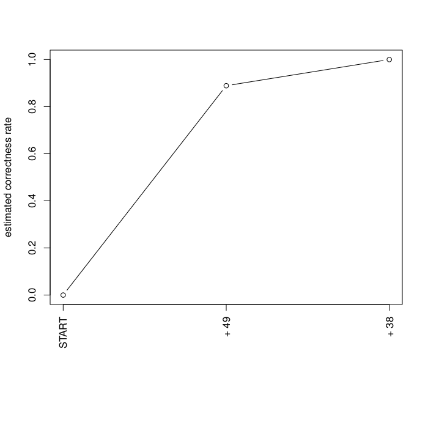
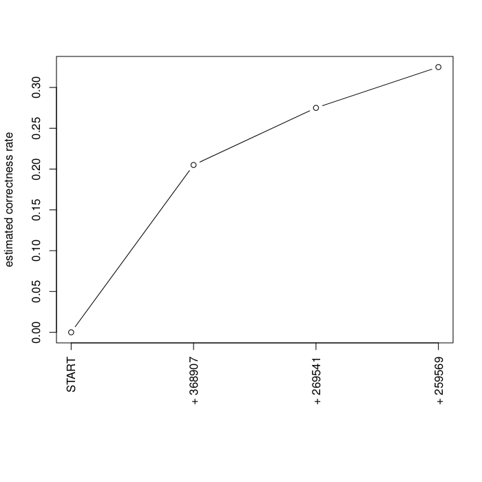

====================================
Discriminant Function Analysis (DFA)
====================================

Synopsis
--------
DFA is a method that it heavily related to ANOVA/MANOVA, except that it operates
in the opposite direction. ANOVA/MANOVA test whether categorical independent
variable(s) effectively predict continuous dependent variable(s). On the other
hand, DFA tests how well one or more independent continuous variables predicts a
categorical dependent variable. In a nutshell, DFA seeks to answer the question
"Is this set of variables effective at predicting category/group membership?"
[:ref:`1 <dfaref1>`]. Applied to ecology, DFA can answer the question "Are these
species/OTUs effective at predicting category/group membership?" or "What is the
best combination of species/OTUs for predicting category/group membersip?"

Introduction
------------
The Discriminant Function Analysis (DFA) method tests how effective one or more
continuous independent variables are at predicting group/category membership
(for a predefined categorical dependent variable). DFA seeks to answer exactly
the opposite question that ANOVA/MANOVA does. Basically, it finds axes (i.e.
linear combinations of variables) that are most effective at predicting group
membership for predefined groups [:ref:`2 <dfaref2>`]. Thus, DFA is a type of
categorical/classification statistical method.

In the context of ecology, DFA can be used to find the best combination of
environmental/species variables in an environment/OTU table that predict group
membership. Using DFA to find the best combination of independent variables to
predict group membership is known as stepwise DFA [:ref:`4 <dfaref4>`].

DFA answers the same question as logistic regression, and logistic regression is
generally preferred over DFA because it can handle both categorical and
continuous variables and its assumptions are more relaxed. DFA assumes the
predictor variables are normally distributed, linearly related, and of equal
variance within each group, while logistic regression is not bound by these
assumptions [:ref:`3 <dfaref3>`].

Existing Implementations
------------------------
There are existing implementations of DFA in the following statistical packages:

* MASS/klaR packages for R

* Statistica [:ref:`4 <dfaref4>`]

* SPSS

* Stata 12

* possibly others...

The implementation of DFA in the MASS/klaR packages for R seems to be the best
one to go with for initial testing because it is open source and we have
routines to handle QIIME's data file formats in R. It also seems to be the most
widely used (SPSS also seems to be popular) in terms of online resources and
tutorials. The following sections of the document will explain how to run the
DFA script.

System Setup and Required Dependencies
--------------------------------------
:note: The following instructions have been tested on 64-bit Linux Mint (essentially Debian). However, they `should` work across different Linux distros and on Macs, though some commands may need to be tweaked, or different package names might have to be used. The instructions assume you use bash as your shell.

The first step is to install R and the MASS package. The following commands
downloaded and installed R (for me, it was R version 2.13.1) and MASS (for me,
it was version 7.3): ::

    sudo apt-get install r-base
    sudo apt-get install r-cran-mass

Next, you must install the optparse and klaR packages in R. Run the following
commands: ::

    sudo R
    install.packages("optparse")
    install.packages("klaR")
    q()

The install process for the packages will prompt you to choose a mirror to
download them from. Other than that, it is completely automated. On my system, I
ended up with optparse version 0.9.4 and klaR version 0.6-6.

Next, your system must have a version of QIIME installed (I used the latest
version of QIIME in SVN). The DFA script uses some R utility functions in QIIME
to load data.

Next, you must define an environment variable to tell the DFA script where to
look for the R utility functions in QIIME. Run the following command, changing
the path to point to the location of your QIIME install: ::

    export QIIME_DIR=/home/jrideout/qiime/trunk

If you don't want to have to perform this step each time you open a new
terminal, run the following command to add it to your .bashrc: ::

    echo "export QIIME_DIR=/home/jrideout/qiime/trunk" >> ~/.bashrc
    source ~/.bashrc

Next, run the following command to test if you can run the DFA script: ::

    R --slave --args -h < dfa.r

This should run the script in "help" mode. If instructions for how to run the
script are printed, you have successfully configured your system.

Input Files
-----------
The DFA script requires a QIIME classic OTU table file and a metadata mapping
file. I used the OTU table and mapping file from the QIIME overview tutorial.
You can get the OTU table :download:`here <../downloads/overview_otu_table.txt>`
and the mapping file :download:`here <../downloads/Fasting_Map.txt>`.

Next, run the following command to execute the DFA script: ::

    R --slave --args -i overview_otu_table.txt -m Fasting_Map.txt -c Treatment -o dfa_output < r/dfa.r

The -c option specifies which column in the mapping file will be used as the
grouping (dependent) variable. The -o option specifies the directory that we
want the results written to.

Output Files
------------
The command in the previous section creates two output files in the specified
output directory. The first file is named :file:`dfa_results.txt`. The resulting
file should look like this: ::

    method      : lda
    final model : qiime.data$map[[opts$category]] ~ 38 + 49
    <environment: 0x23ebcf8>

    correctness rate = 1

The portion of the output that we are interested in is the second line. The
final model tells us that the category/grouping dependent variable (specified
with the -c option) is best predicted by OTUs 38 and 49. The prediction
correction rate is also given, which indicates that OTUs 38 and 49 correctly
predict 100% of the samples' group memberships in the Treatment category. The
first line of the file tells us that linear DFA was used in the stepwise
process.

The second output file is named :file:`dfa_plot.pdf`:

This plot shows the results of the stepwise component of DFA that was used to
determine the best combination of explanatory variables to use as the final
model. At START, the correctness rate is 0% because no explanatory variables are
used yet in the model. When OTU 49 is added, the correctness rate jumps up to
around 90%. Adding OTU 38 to the model brings the correctness rate up to 100%,
giving us our final model.

Testing Results
---------------
This section will describe different tests that were run on the DFA script.
These tests will use empirical data from one of the several datasets that the
team has access to. These data files will not be included for download due to
their (usually) large size. Unless otherwise noted, the data files that were
used can be found under the datasets directory.

Whole Body
^^^^^^^^^^
Test 1
~~~~~~
**Description:**

This test uses the `BODY_SITE` category. We want to see what OTUs best predict
the type of body site a sample is in.

**Command:** ::

    R --slave --args -i datasets/whole_body/otu_table.txt -m datasets/whole_body/map.txt -c BODY_SITE -o dfa_output < r/dfa.r

**Results:**

The following output files are created: ::

    method      : lda 
    final model : qiime.data$map[[opts$category]] ~ 368907 + 269541 + 259569
    <environment: 0x31ce350>
    
    correctness rate = 0.325 

The text output indicates that the combination of OTUs 368907, 269541, and
259569 best predict the body site that the sample will be in. The correctness
rate is 32.5%. The plot shows the correctness rate increasing as OTUs are added
to the model. By default, DFA stops adding OTUs if the correctness rate improves
less than 5%.

OTU 368907 is: ::

    k__Bacteria;p__Actinobacteria;c__Actinobacteria (class);o__Actinomycetales;f__Propionibacteriaceae;g__Propionibacterium;s__Propionibacterium acnes

OTU 269541 is: ::

    k__Bacteria;p__Firmicutes;c__Bacilli;o__Bacillales;f__Staphylococcaceae;g__Staphylococcus;s__

OTU 259569 is: ::

    k__Bacteria;p__Bacteroidetes;c__Bacteroidia;o__Bacteroidales;f__Rikenellaceae;g__Alistipes;s__Alistipes putredinis

I'm not sure if these results are meaningful or not. I will talk with Greg and
see if he has any papers that I can refer to in order to determine whether these
results make sense or not.

Test 2
~~~~~~
**Description:**

This test uses the `BODY_SITE` category again, but this time the sample IDs are
shuffled in the OTU table. We want to see what OTUs best predict the type of
body site, given shuffled samples. This test is a negative control. We use three
different shuffled OTU tables.

**Command:** ::

    R --slave --args -i datasets/whole_body/otu_table_shuffled_1.txt -m datasets/whole_body/map.txt -c BODY_SITE -o dfa_output < r/dfa.r
    R --slave --args -i datasets/whole_body/otu_table_shuffled_2.txt -m datasets/whole_body/map.txt -c BODY_SITE -o dfa_output < r/dfa.r
    R --slave --args -i datasets/whole_body/otu_table_shuffled_3.txt -m datasets/whole_body/map.txt -c BODY_SITE -o dfa_output < r/dfa.r

**Results:**

The following output files are created:

TODO: finish adding results of these tests

References
----------
.. _dfaref1:

[1] http://en.wikipedia.org/wiki/Discriminant_function_analysis

.. _dfaref2:

[2] http://www.zoology.ubc.ca/~schluter/bio501/Rtips.multivariate.html

.. _dfaref3:

[3] http://userwww.sfsu.edu/~efc/classes/biol710/discrim/discrim.pdf

.. _dfaref4:

[3] http://www.statsoft.com/textbook/discriminant-function-analysis/
