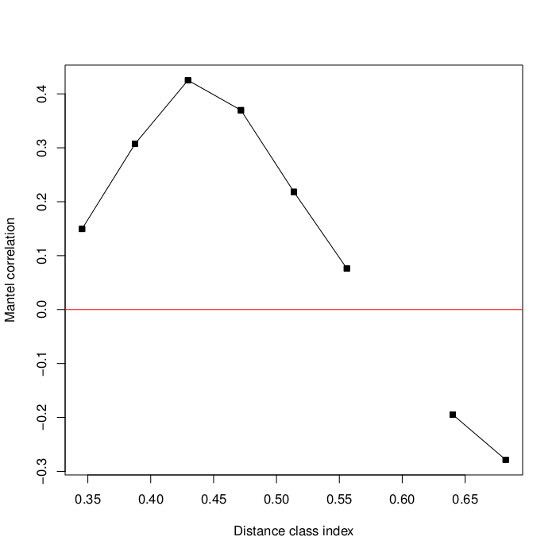

==================
Mantel Correlogram
==================

Introduction
------------
The Mantel correlogram method computes a Mantel statistic for each geographic
distance class that can be derived from the input. It tests for significance of
genetic/community distance versus geographic distance. The null hypothesis that
is tested is that there is no association of geographic distance to community
distance for each distance class.

Sturge's rule [:ref:`5 <mantelcorref5>`] is used to determine how many distance
classes to use based on the number of pairwise comparisons you have. These
distance classes can be thought of as bins, as used in histograms. For each
distance class, a Mantel test is performed and a Mantel statisic is computed. A
corrected p-value (i.e.  Bonferroni, FDR, Holm, etc.) is also computed for each
test. The results of this method are usually visualized in a correlogram, which
is a graph with the geographic distance classes on the x-axis and the Mantel
statistics on the y-axis [:ref:`6 <mantelcorref6>`].

This method is very similar to the Mantel method, so the resulting Mantel
statistics can be interpreted in the same way as you would for a traditional
Mantel test (i.e. a positive value indicates positive spatial correlation).
p-values are obtained in the same way as well (i.e. through permutations). For
more information about Mantel, please refer to the Mantel documentation page.

The original paper presenting this method can be found here
[:ref:`3 <mantelcorref3>`]. An example of the application of this method to a
microbial ecology study can be found here [:ref:`4 <mantelcorref4>`].

Existing Implementations
------------------------
There are existing implementations of Mantel correlogram in the following
statistical packages:

* vegan package for R (function `mantel.correlog`)

* PASSaGE [:ref:`1 <mantelcorref1>`]

* PAST [:ref:`2 <mantelcorref2>`]

PASSaGE and PAST are free but are only available on Windows. The R
implementation seems to be the most promising and easiest to use since it is
free, open source, and we are already using several vegan functions for testing
other methods.

I wrote an R script that loads in two QIIME distance matrices and calls the
vegan function `mantel.correlog`. The script has been checked into the
Qiimeutils repository under :file:`microbiogeo/r/mantel_correlogram.r`. The
following sections of the document will explain how to set up your system to run
the script.

System Setup and Required Dependencies
--------------------------------------
:note: The following instructions have been tested on 64-bit Linux Mint (essentially Debian). However, they `should` work across different Linux distros and on Macs, though some commands may need to be tweaked, or different package names might have to be used. The instructions assume you use bash as your shell.

The first step is to install R. The following command downloaded and installed R
(for me, it was R version 2.13.1): ::

    sudo apt-get install r-base

Next, you must install the vegan and optparse packages in R. Run the following
commands: ::

    sudo R
    install.packages("vegan")
    install.packages("optparse")
    q()

The install process for the packages will prompt you to choose a mirror to
download them from. Other than that, it is completely automated. On my system, I
ended up with vegan version 2.0-2 and optparse version 0.9.4.

Next, your system must have a version of QIIME installed (I used the latest
version of QIIME in SVN). The script uses some R utility functions in QIIME to
load data.

Next, you must define an environment variable to tell the script where to look
for the R utility functions in QIIME. Run the following command, changing the
path to point to the location of your QIIME install: ::

    export QIIME_DIR=/home/jrideout/qiime/trunk

If you don't want to have to perform this step each time you open a new
terminal, run the following command to add it to your .bashrc: ::

    echo "export QIIME_DIR=/home/jrideout/qiime/trunk" >> ~/.bashrc
    source ~/.bashrc

Next, run the following command to test if you can run the script: ::

    R --slave --args -h < r/mantel_correlogram.r

This should run the script in "help" mode. If instructions for how to run the
script are printed, you have successfully configured your system.

Input Files
-----------
The script requires a QIIME distance matrix file (i.e. the result of
beta_diversity.py) and a QIIME distance matrix file containing geographic
distances between samples (i.e. spatial distances). You can get the two distance
matrices :download:`here <../downloads/partial_mantel_ready_to_run.zip>`. The
data used here is from the Fierer et al Keyboard Study. This data is also used
for testing the partial Mantel method, but we will only be using two of the
three distance matrices.

After unzipping the file, run the following command to execute the script: ::

    R --slave --args -d unweighted_unifrac_dm_keyboard_only_239.txt -s unweighted_euclidean_dm.txt < r/mantel_correlogram.r

Output Files
------------
The command in the previous section creates two output files named
:file:`mantel_correlogram_results.txt` and :file:`mantel_correlogram_plot.pdf`
in the current directory (the output directory can be specified with the `-o`
option). The first file contains a summary of the Mantel correlogram results: ::

    Mantel Correlogram Analysis
    
    Call:
     
    mantel.correlog(D.eco = as.dist(distmat), D.geo = as.dist(geodistmat)) 
    
            class.index     n.dist Mantel.cor Pr(Mantel) Pr(corrected)    
    D.cl.1     0.345425  20.000000   0.149589      0.001         0.001 ***
    D.cl.2     0.387531 114.000000   0.307236      0.001         0.002 ** 
    D.cl.3     0.429638 324.000000   0.425177      0.001         0.003 ** 
    D.cl.4     0.471745 446.000000   0.369716      0.001         0.004 ** 
    D.cl.5     0.513851 470.000000   0.218257      0.001         0.005 ** 
    D.cl.6     0.555958 556.000000   0.076217      0.002         0.006 ** 
    D.cl.7     0.598064 642.000000         NA         NA            NA    
    D.cl.8     0.640171 778.000000  -0.194795      0.001         0.007 ** 
    D.cl.9     0.682278 930.000000  -0.278508      0.001         0.008 ** 
    D.cl.10    0.724384 648.000000  -0.251729      0.001            NA    
    D.cl.11    0.766491 352.000000         NA         NA            NA    
    D.cl.12    0.808597 106.000000         NA         NA            NA    
    D.cl.13    0.850704  16.000000         NA         NA            NA    
    ---
    Signif. codes:  0 ‘***’ 0.001 ‘**’ 0.01 ‘*’ 0.05 ‘.’ 0.1 ‘ ’ 1 

The second file is a plot of the distance classes versus their associated Mantel
statistic:

The text output file shows the Mantel correlation statistic and p-value for the
eight distance classes. All eight distance classes are significant due to their
low p-values. The correlogram plot has these distance classes plotted versus
their Mantel correlation statistics. The shaded points indicate significance
(all are shaded in this example). Thus, this example seems to strongly indicate
that positive spatial correlation exists for six of the eight distance classes.
The two rightmost points on the graph indicate that negative spatial correlation
exists.

Testing Results
---------------
This section will describe different tests that were run on the Mantel
correlogram script.

:note: Many of these tests will use empirical data from one of the several datasets that the team has access to. These data files will not be included for download due to their (usually) large size, but it should be clear what inputs were used.

TODO finish this section

References
----------
.. _mantelcorref1:

[1] http://www.passagesoftware.net/download.php

.. _mantelcorref2:

[2] http://folk.uio.no/ohammer/past/

.. _mantelcorref3:

[3] Legendre, P. and L. Legendre. 1998. Numerical ecology, 2nd English edition. Elsevier Science BV, Amsterdam

.. _mantelcorref4:

[4] http://www.plosone.org/article/info%3Adoi%2F10.1371%2Fjournal.pone.0023742

.. _mantelcorref5:

[5] http://rchsbowman.wordpress.com/2010/08/22/statistics-notes-sturges-rule/

.. _mantelcorref6:

[6] vegan's documentation for function 'mantel.correlog'
