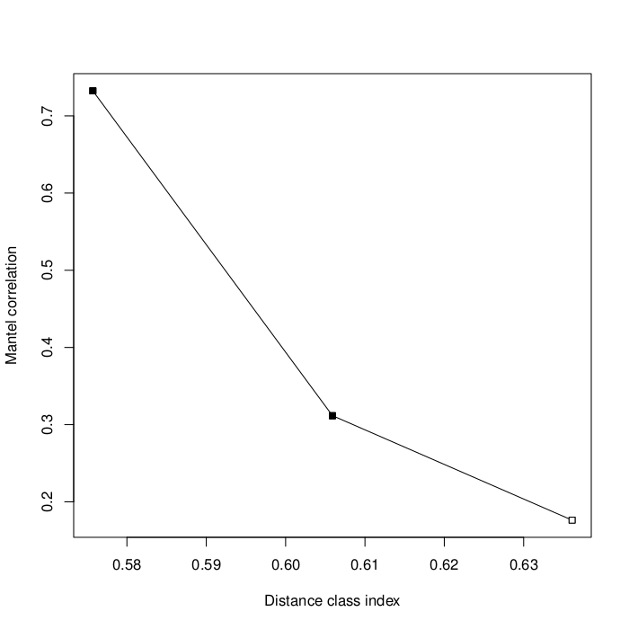
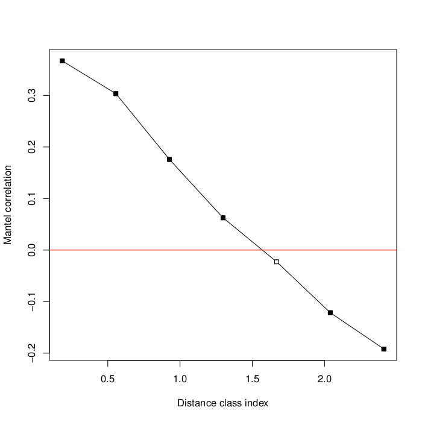
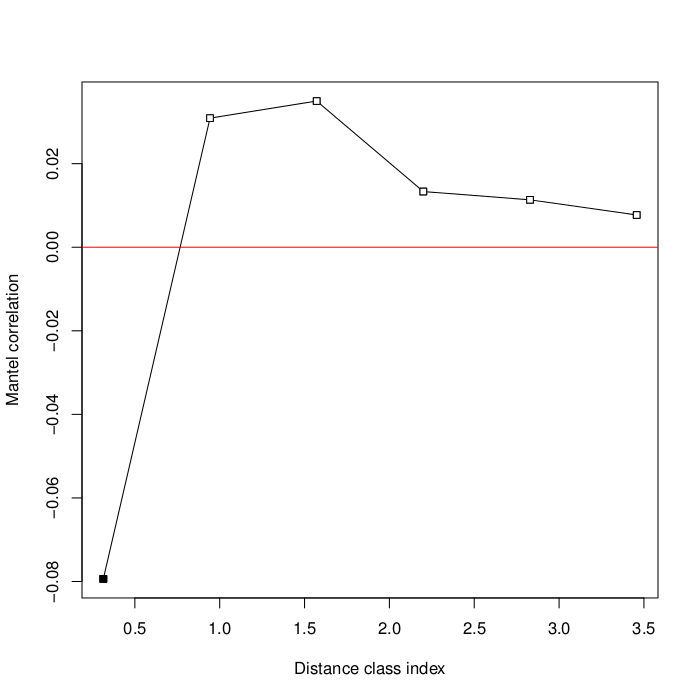
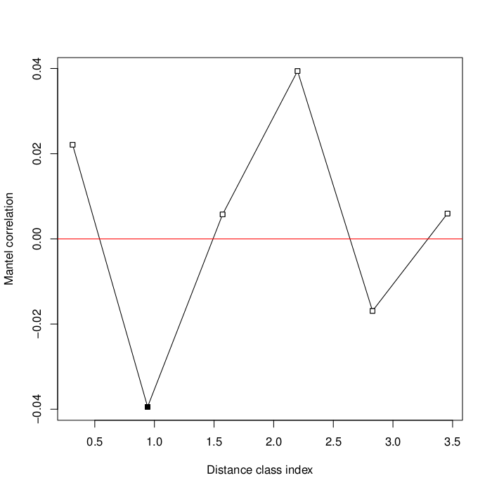
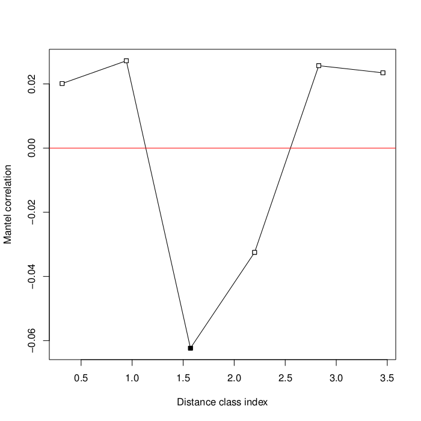
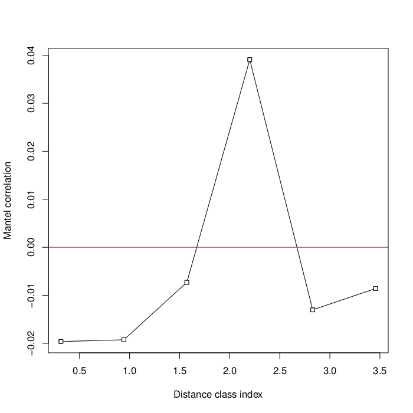
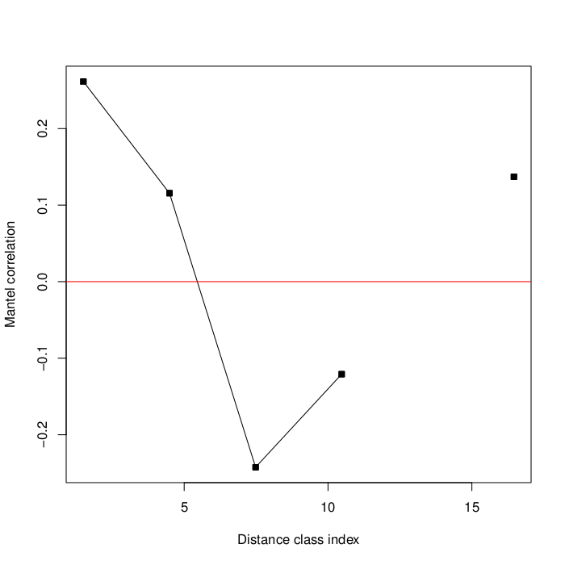
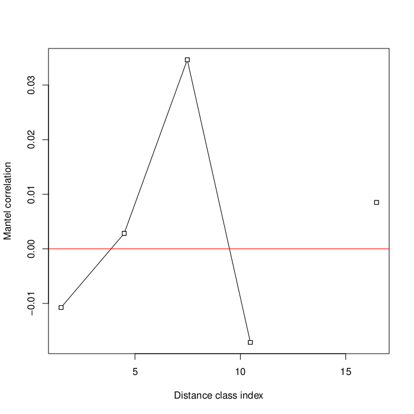
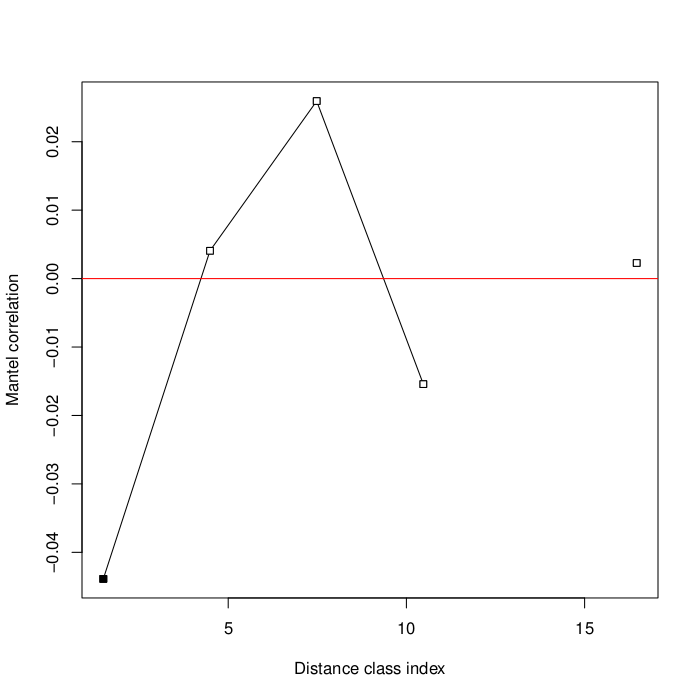
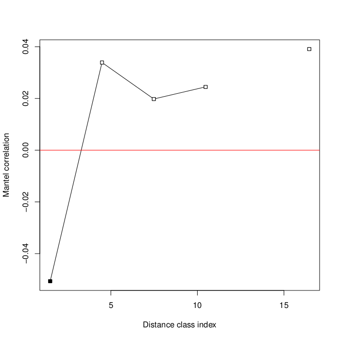

==================
Mantel Correlogram
==================

Introduction
------------
The Mantel correlogram method computes a Mantel statistic for each geographic
distance class that can be derived from the input. It tests for significance of
genetic/community distance versus geographic distance. The null hypothesis that
is tested is that there is no association of geographic distance to community
distance for each distance class.

Sturge's rule [:ref:`5 <mantelcorref5>`] is used to determine how many distance
classes to use based on the number of pairwise comparisons you have. These
distance classes can be thought of as bins, as used in histograms. For each
distance class, a Mantel test is performed and a Mantel statisic is computed. A
corrected p-value (i.e.  Bonferroni, FDR, Holm, etc.) is also computed for each
test. The results of this method are usually visualized in a correlogram, which
is a graph with the geographic distance classes on the x-axis and the Mantel
statistics on the y-axis [:ref:`6 <mantelcorref6>`].

This method is very similar to the Mantel method, so the resulting Mantel
statistics can be interpreted in the same way as you would for a traditional
Mantel test (i.e. a positive value indicates positive spatial correlation).
p-values are obtained in the same way as well (i.e. through permutations). For
more information about Mantel, please refer to the Mantel documentation page.

The original paper presenting this method can be found here
[:ref:`3 <mantelcorref3>`]. An example of the application of this method to a
microbial ecology study can be found here [:ref:`4 <mantelcorref4>`].

Existing Implementations
------------------------
There are existing implementations of Mantel correlogram in the following
statistical packages:

* vegan package for R (function `mantel.correlog`)

* PASSaGE [:ref:`1 <mantelcorref1>`]

* PAST [:ref:`2 <mantelcorref2>`]

PASSaGE and PAST are free but are only available on Windows. The R
implementation seems to be the most promising and easiest to use since it is
free, open source, and we are already using several vegan functions for testing
other methods.

I wrote an R script that loads in two QIIME distance matrices and calls the
vegan function `mantel.correlog`. The script has been checked into the
Qiimeutils repository under :file:`microbiogeo/r/mantel_correlogram.r`. The
following sections of the document will explain how to set up your system to run
the script.

System Setup and Required Dependencies
--------------------------------------
:note: The following instructions have been tested on 64-bit Linux Mint (essentially Debian). However, they `should` work across different Linux distros and on Macs, though some commands may need to be tweaked, or different package names might have to be used. The instructions assume you use bash as your shell.

The first step is to install R. The following command downloaded and installed R
(for me, it was R version 2.13.1): ::

    sudo apt-get install r-base

Next, you must install the vegan and optparse packages in R. Run the following
commands: ::

    sudo R
    install.packages("vegan")
    install.packages("optparse")
    q()

The install process for the packages will prompt you to choose a mirror to
download them from. Other than that, it is completely automated. On my system, I
ended up with vegan version 2.0-2 and optparse version 0.9.4.

Next, your system must have a version of QIIME installed (I used the latest
version of QIIME in SVN). The script uses some R utility functions in QIIME to
load data.

Next, you must define an environment variable to tell the script where to look
for the R utility functions in QIIME. Run the following command, changing the
path to point to the location of your QIIME install: ::

    export QIIME_DIR=/home/jrideout/qiime/trunk

If you don't want to have to perform this step each time you open a new
terminal, run the following command to add it to your .bashrc: ::

    echo "export QIIME_DIR=/home/jrideout/qiime/trunk" >> ~/.bashrc
    source ~/.bashrc

Next, run the following command to test if you can run the script: ::

    R --slave --args -h < r/mantel_correlogram.r

This should run the script in "help" mode. If instructions for how to run the
script are printed, you have successfully configured your system.

Input Files
-----------
The script requires a QIIME distance matrix file (i.e. the result of
beta_diversity.py) and a QIIME distance matrix file containing geographic
distances between samples (i.e. spatial distances). I used the unweighted
Unifrac distance matrix from the QIIME overview tutorial as input for both
distance matrices. This example is not particularly useful, but is simple and
demonstrates the inputs and outputs produced by this script. You can get the
distance matrix
:download:`here <../downloads/overview_unweighted_unifrac_dm.txt>`.

Run the following command: ::

    R --slave --args -d overview_unweighted_unifrac_dm.txt -s overview_unweighted_unifrac_dm.txt < r/mantel_correlogram.r 

Output Files
------------
The command in the previous section creates two output files named
:file:`mantel_correlogram_results.txt` and :file:`mantel_correlogram_plot.pdf`
in the current directory (the output directory can be specified with the `-o`
option). The first file contains a summary of the Mantel correlogram results: ::

    Mantel Correlogram Analysis

    Call:
     
    mantel.correlog(D.eco = as.dist(distmat), D.geo = as.dist(geodistmat)) 

           class.index   n.dist Mantel.cor Pr(Mantel) Pr(corrected)    
    D.cl.1     0.57571 12.00000    0.73245      0.001         0.001 ***
    D.cl.2     0.60590  6.00000    0.31158      0.035         0.035 *  
    D.cl.3     0.63610  8.00000    0.17627      0.144         0.144    
    D.cl.4     0.66630 10.00000         NA         NA            NA    
    D.cl.5     0.69650 12.00000         NA         NA            NA    
    D.cl.6     0.72670 16.00000         NA         NA            NA    
    D.cl.7     0.75690  8.00000         NA         NA            NA    
    ---
    Signif. codes:  0 ‘***’ 0.001 ‘**’ 0.01 ‘*’ 0.05 ‘.’ 0.1 ‘ ’ 1 

The second file is a plot of the distance classes versus their associated Mantel
statistic:

The text output file shows the Mantel correlation statistic and p-value for the
three distance classes. The first two distance classes are significant due to
their low p-values. The correlogram plot has these distance classes plotted
versus their Mantel correlation statistics. The shaded points indicate
results that were significant. This example seems to strongly indicate positive
spatial correlation for the first two distance classes, which is what we would
expect since we used the same distance matrix as input for both the unifrac and
spatial distance matrices.

Testing Results
---------------
This section will describe different tests that were run on the Mantel
correlogram script. These tests will use empirical data from one of the several
datasets that the team has access to. These data files will not be included for
download due to their (usually) large size. Unless otherwise noted, the data
files that were used can be found under the datasets directory.

88 Soils
^^^^^^^^

Test 1
~~~~~~
**Description:**

This test uses a distance matrix containing difference in PH for the distances
(derived from the `PH` category in the mapping file using
:file:`distance_matrix_from_mapping.py`). This test is a positive control
becasue we expect there to be positive correlation between the two matrices due
to previous results obtained from this study.

**Command:** ::

    R --slave --args -d datasets/88_soils/unweighted_unifrac_dm.txt -s datasets/88_soils/PH_dm.txt < r/mantel_correlogram.r

**Results:**

The following output files are created: ::

    Mantel Correlogram Analysis

    Call:
     
    mantel.correlog(D.eco = as.dist(distmat), D.geo = as.dist(geodistmat)) 

            class.index     n.dist Mantel.cor Pr(Mantel) Pr(corrected)    
    D.cl.1     0.185385 874.000000   0.366968      0.001         0.001 ***
    D.cl.2     0.556154 830.000000   0.303484      0.001         0.002 ** 
    D.cl.3     0.926923 780.000000   0.175833      0.001         0.003 ** 
    D.cl.4     1.297692 706.000000   0.062617      0.004         0.004 ** 
    D.cl.5     1.668462 616.000000  -0.022810      0.115         0.115    
    D.cl.6     2.039231 572.000000  -0.121410      0.001         0.006 ** 
    D.cl.7     2.410000 458.000000  -0.191866      0.001         0.007 ** 
    D.cl.8     2.780769 326.000000         NA         NA            NA    
    D.cl.9     3.151538 238.000000         NA         NA            NA    
    D.cl.10    3.522308 202.000000         NA         NA            NA    
    D.cl.11    3.893077 146.000000         NA         NA            NA    
    D.cl.12    4.263846  82.000000         NA         NA            NA    
    D.cl.13    4.634615  22.000000         NA         NA            NA    
    ---
    Signif. codes:  0 ‘***’ 0.001 ‘**’ 0.01 ‘*’ 0.05 ‘.’ 0.1 ‘ ’ 1 

The output text file indicates that seven distance classes were chosen, six of
which were significant (shown in the `Pr(corrected)` column). The output plot is
another view of this data (this is the correlogram itself). The x-axis is in
units of PH. You can see that there is significant positive correlation for the
"closer" distance classes, which degrades into negative correlation with the
larger distance classes. These results show that positive correlation only
exists in communities from PH levels that are around 1.29 different in PH. After
that, the positive correlation relationship begins to break down, which may be
due to the vast change in PH that results in very different communities that do
not exhibit correlative structure.

Test 2
~~~~~~
**Description:**

This test uses a distance matrix containing difference in latitude for the
distances (derived from the `LATITUDE` category in the mapping file using
:file:`distance_matrix_from_mapping.py`). This test is a negative control
becasue we don't expect to see spatial structure between the two matrices due to
previous results obtained from this study.

**Command:** ::

    R --slave --args -d datasets/88_soils/unweighted_unifrac_dm.txt -s datasets/88_soils/LATITUDE_dm.txt < r/mantel_correlogram.r

**Results:**

The following output files are created: ::

    Mantel Correlogram Analysis

    Call:
     
    mantel.correlog(D.eco = as.dist(distmat), D.geo = as.dist(geodistmat)) 

            class.index      n.dist  Mantel.cor Pr(Mantel) Pr(corrected)    
    D.cl.1   3.7064e+00  2.3100e+03  1.8805e-01      0.001         0.001 ***
    D.cl.2   1.1119e+01  1.0780e+03  6.6796e-03      0.408         0.408    
    D.cl.3   1.8532e+01  6.0600e+02 -5.0502e-02      0.063         0.126    
    D.cl.4   2.5945e+01  3.6800e+02  3.1754e-02      0.168         0.336    
    D.cl.5   3.3358e+01  2.7400e+02 -5.6136e-02      0.038         0.152    
    D.cl.6   4.0771e+01  2.4000e+01 -5.8981e-02      0.009         0.045 *  
    D.cl.7   4.8183e+01  4.0000e+02          NA         NA            NA    
    D.cl.8   5.5596e+01  2.7000e+02          NA         NA            NA    
    D.cl.9   6.3009e+01  2.4600e+02          NA         NA            NA    
    D.cl.10  7.0422e+01  1.5000e+02          NA         NA            NA    
    D.cl.11  7.7835e+01  7.2000e+01          NA         NA            NA    
    D.cl.12  8.5247e+01  3.0000e+01          NA         NA            NA    
    D.cl.13  9.2660e+01  2.4000e+01          NA         NA            NA    
    ---
    Signif. codes:  0 ‘***’ 0.001 ‘**’ 0.01 ‘*’ 0.05 ‘.’ 0.1 ‘ ’ 1

.. image:: ../images/mantel_correlogram/88_soils_test_2.png
   :align: center

The output text file only shows two significant distance classes, and these are
sitting very close to zero, indicating no spatial structure. Furthermore, the
other four distance classes are even closer to zero and are not significant at
all. We expected to see these results using the latitudes from this study. These
results imply that the communities may be globally distributed (i.e. no strong
spatial structure).

Keyboard
^^^^^^^^

Test 1
~~~~~~
**Description:**

This test uses a distance matrix containing euclidean distances between the keys
on the keyboards. We don't really know what results to expect from this test.

**Command:** ::

    R --slave --args -d datasets/keyboard/unweighted_unifrac_dm_keyboard_only_239.txt -s datasets/keyboard/unweighted_euclidean_dm.txt < r/mantel_correlogram.r

**Results:**

The following output files are created: ::

    Mantel Correlogram Analysis

    Call:
     
    mantel.correlog(D.eco = as.dist(distmat), D.geo = as.dist(geodistmat)) 

            class.index      n.dist  Mantel.cor Pr(Mantel) Pr(corrected)    
    D.cl.1    0.3142873 120.0000000  -0.0793657      0.001         0.001 ***
    D.cl.2    0.9428618 296.0000000   0.0308909      0.051         0.051 .  
    D.cl.3    1.5714363 986.0000000   0.0349811      0.069         0.102    
    D.cl.4    2.2000108 684.0000000   0.0133314      0.247         0.247    
    D.cl.5    2.8285853 806.0000000   0.0113470      0.258         0.494    
    D.cl.6    3.4571598 932.0000000   0.0077198      0.346         0.741    
    D.cl.7    4.0857344 536.0000000          NA         NA            NA    
    D.cl.8    4.7143089 406.0000000          NA         NA            NA    
    D.cl.9    5.3428834 326.0000000          NA         NA            NA    
    D.cl.10   5.9714579 134.0000000          NA         NA            NA    
    D.cl.11   6.6000324  68.0000000          NA         NA            NA    
    D.cl.12   7.2286069  68.0000000          NA         NA            NA    
    D.cl.13   7.8571815  40.0000000          NA         NA            NA    
    ---
    Signif. codes:  0 ‘***’ 0.001 ‘**’ 0.01 ‘*’ 0.05 ‘.’ 0.1 ‘ ’ 1 

Out of the six distance classes, only one is signifcant and it indicates
negative spatial correlation. The other five classes sit very close to zero and
are not significant. These results don't suggest spatial structure for the
keyboard study.

Test 2
~~~~~~
**Description:**

This test uses the same euclidean distance matrix used in the previous test, but
three shuffled unifrac distance matrices are used as negative control tests. We
don't expect to see spatial structure emerge from these runs.

**Command:** ::

    R --slave --args -d datasets/keyboard/unweighted_unifrac_dm_keyboard_only_239_shuffled_1.txt -s datasets/keyboard/unweighted_euclidean_dm.txt < r/mantel_correlogram.r 
    R --slave --args -d datasets/keyboard/unweighted_unifrac_dm_keyboard_only_239_shuffled_2.txt -s datasets/keyboard/unweighted_euclidean_dm.txt < r/mantel_correlogram.r 
    R --slave --args -d datasets/keyboard/unweighted_unifrac_dm_keyboard_only_239_shuffled_3.txt -s datasets/keyboard/unweighted_euclidean_dm.txt < r/mantel_correlogram.r 

**Results:**

The following output files are created: ::

    Mantel Correlogram Analysis

    Call:
     
    mantel.correlog(D.eco = as.dist(distmat), D.geo = as.dist(geodistmat)) 

            class.index      n.dist  Mantel.cor Pr(Mantel) Pr(corrected)  
    D.cl.1    0.3142873 120.0000000   0.0221056      0.128         0.128  
    D.cl.2    0.9428618 296.0000000  -0.0394410      0.017         0.034 *
    D.cl.3    1.5714363 986.0000000   0.0057385      0.370         0.370  
    D.cl.4    2.2000108 684.0000000   0.0394074      0.026         0.078 .
    D.cl.5    2.8285853 806.0000000  -0.0169192      0.184         0.384  
    D.cl.6    3.4571598 932.0000000   0.0059525      0.382         0.740  
    D.cl.7    4.0857344 536.0000000          NA         NA            NA  
    D.cl.8    4.7143089 406.0000000          NA         NA            NA  
    D.cl.9    5.3428834 326.0000000          NA         NA            NA  
    D.cl.10   5.9714579 134.0000000          NA         NA            NA  
    D.cl.11   6.6000324  68.0000000          NA         NA            NA  
    D.cl.12   7.2286069  68.0000000          NA         NA            NA  
    D.cl.13   7.8571815  40.0000000          NA         NA            NA  
    ---
    Signif. codes:  0 ‘***’ 0.001 ‘**’ 0.01 ‘*’ 0.05 ‘.’ 0.1 ‘ ’ 1

::

    Mantel Correlogram Analysis

    Call:
     
    mantel.correlog(D.eco = as.dist(distmat), D.geo = as.dist(geodistmat)) 

            class.index     n.dist Mantel.cor Pr(Mantel) Pr(corrected)  
    D.cl.1     0.314287 120.000000   0.020117      0.130         0.130  
    D.cl.2     0.942862 296.000000   0.027207      0.077         0.154  
    D.cl.3     1.571436 986.000000  -0.062344      0.004         0.012 *
    D.cl.4     2.200011 684.000000  -0.032497      0.067         0.201  
    D.cl.5     2.828585 806.000000   0.025684      0.093         0.268  
    D.cl.6     3.457160 932.000000   0.023457      0.118         0.335  
    D.cl.7     4.085734 536.000000         NA         NA            NA  
    D.cl.8     4.714309 406.000000         NA         NA            NA  
    D.cl.9     5.342883 326.000000         NA         NA            NA  
    D.cl.10    5.971458 134.000000         NA         NA            NA  
    D.cl.11    6.600032  68.000000         NA         NA            NA  
    D.cl.12    7.228607  68.000000         NA         NA            NA  
    D.cl.13    7.857181  40.000000         NA         NA            NA  
    ---
    Signif. codes:  0 ‘***’ 0.001 ‘**’ 0.01 ‘*’ 0.05 ‘.’ 0.1 ‘ ’ 1 

::

    Mantel Correlogram Analysis

    Call:
     
    mantel.correlog(D.eco = as.dist(distmat), D.geo = as.dist(geodistmat)) 

            class.index     n.dist Mantel.cor Pr(Mantel) Pr(corrected)  
    D.cl.1     0.314287 120.000000  -0.019630      0.149         0.149  
    D.cl.2     0.942862 296.000000  -0.019265      0.157         0.298  
    D.cl.3     1.571436 986.000000  -0.007296      0.369         0.447  
    D.cl.4     2.200011 684.000000   0.039091      0.022         0.088 .
    D.cl.5     2.828585 806.000000  -0.013040      0.231         0.596  
    D.cl.6     3.457160 932.000000  -0.008589      0.321         0.745  
    D.cl.7     4.085734 536.000000         NA         NA            NA  
    D.cl.8     4.714309 406.000000         NA         NA            NA  
    D.cl.9     5.342883 326.000000         NA         NA            NA  
    D.cl.10    5.971458 134.000000         NA         NA            NA  
    D.cl.11    6.600032  68.000000         NA         NA            NA  
    D.cl.12    7.228607  68.000000         NA         NA            NA  
    D.cl.13    7.857182  40.000000         NA         NA            NA  
    ---
    Signif. codes:  0 ‘***’ 0.001 ‘**’ 0.01 ‘*’ 0.05 ‘.’ 0.1 ‘ ’ 1 

The output of these three tests all give the results we were expecting from the
negative control: there does not seem to be any spatial structure detected when
using shuffled distance matrices. All of the Mantel statistics are very close to
zero and most are not significant.

Glen Canyon
^^^^^^^^^^^

Test 1
~~~~~~
**Description:**

This test uses a distance matrix containing differences in time since samples
were last submerged (derived from the
`estimated_years_since_submerged_for_plotting` category in the mapping file
using :file:`distance_matrix_from_mapping.py`). We don't really know what
results to expect from this test.

**Command:** ::

    R --slave --args -d datasets/glen_canyon/unweighted_unifrac_dm.txt -s datasets/glen_canyon/estimated_years_since_submerged_for_plotting_dm.txt < r/mantel_correlogram.r 

**Results:**

The following output files are created: ::

    Mantel Correlogram Analysis

    Call:
     
    mantel.correlog(D.eco = as.dist(distmat), D.geo = as.dist(geodistmat)) 

            class.index      n.dist  Mantel.cor Pr(Mantel) Pr(corrected)    
    D.cl.1     1.496429 2310.000000    0.261396      0.001         0.001 ***
    D.cl.2     4.489286  272.000000    0.115547      0.001         0.002 ** 
    D.cl.3     7.482143 1078.000000   -0.242437      0.001         0.003 ** 
    D.cl.4    10.475000  960.000000   -0.120875      0.002         0.004 ** 
    D.cl.5    13.467857    0.000000          NA         NA            NA    
    D.cl.6    16.460714  266.000000    0.137040      0.001         0.005 ** 
    D.cl.7    19.453571  294.000000    0.069393      0.055            NA    
    D.cl.8    22.446429    0.000000          NA         NA            NA    
    D.cl.9    25.439286  706.000000          NA         NA            NA    
    D.cl.10   28.432143 1392.000000          NA         NA            NA    
    D.cl.11   31.425000   96.000000          NA         NA            NA    
    D.cl.12   34.417857  462.000000          NA         NA            NA    
    D.cl.13   37.410714  768.000000          NA         NA            NA    
    D.cl.14   40.403571  138.000000          NA         NA            NA    
    ---
    Signif. codes:  0 ‘***’ 0.001 ‘**’ 0.01 ‘*’ 0.05 ‘.’ 0.1 ‘ ’ 1 

The results indicate that correlative structure exists between the two distance
matrices (positive correlation for the first two distance classes and negative
for the next two). The Mantel statistics for all distance classes are
significant.

Test 2
~~~~~~
**Description:**

This test uses the same 'time since submerged' distance matrix used in the
previous test, but three shuffled unifrac distance matrices are used as negative
control tests. We don't expect to see correlative structure emerge from these
runs.

**Command:** ::

    R --slave --args -d datasets/glen_canyon/unweighted_unifrac_dm_shuffled_1.txt -s datasets/glen_canyon/estimated_years_since_submerged_for_plotting_dm.txt < r/mantel_correlogram.r 
    R --slave --args -d datasets/glen_canyon/unweighted_unifrac_dm_shuffled_2.txt -s datasets/glen_canyon/estimated_years_since_submerged_for_plotting_dm.txt < r/mantel_correlogram.r 
    R --slave --args -d datasets/glen_canyon/unweighted_unifrac_dm_shuffled_3.txt -s datasets/glen_canyon/estimated_years_since_submerged_for_plotting_dm.txt < r/mantel_correlogram.r 

**Results:**

The following output files are created: ::

    Mantel Correlogram Analysis

    Call:
     
    mantel.correlog(D.eco = as.dist(distmat), D.geo = as.dist(geodistmat)) 

            class.index      n.dist  Mantel.cor Pr(Mantel) Pr(corrected)
    D.cl.1   1.4964e+00  2.3100e+03 -1.0745e-02      0.380         0.380
    D.cl.2   4.4893e+00  2.7200e+02  2.8245e-03      0.474         0.760
    D.cl.3   7.4821e+00  1.0780e+03  3.4634e-02      0.204         0.612
    D.cl.4   1.0475e+01  9.6000e+02 -1.7132e-02      0.300         0.900
    D.cl.5   1.3468e+01  0.0000e+00          NA         NA            NA
    D.cl.6   1.6461e+01  2.6600e+02  8.5006e-03      0.422         1.000
    D.cl.7   1.9454e+01  2.9400e+02 -7.7056e-03      0.429            NA
    D.cl.8   2.2446e+01  0.0000e+00          NA         NA            NA
    D.cl.9   2.5439e+01  7.0600e+02          NA         NA            NA
    D.cl.10  2.8432e+01  1.3920e+03          NA         NA            NA
    D.cl.11  3.1425e+01  9.6000e+01          NA         NA            NA
    D.cl.12  3.4418e+01  4.6200e+02          NA         NA            NA
    D.cl.13  3.7411e+01  7.6800e+02          NA         NA            NA
    D.cl.14  4.0404e+01  1.3800e+02          NA         NA            NA

::

    Mantel Correlogram Analysis

    Call:
     
    mantel.correlog(D.eco = as.dist(distmat), D.geo = as.dist(geodistmat)) 

            class.index      n.dist  Mantel.cor Pr(Mantel) Pr(corrected)  
    D.cl.1   1.4964e+00  2.3100e+03 -4.3876e-02      0.029         0.029 *
    D.cl.2   4.4893e+00  2.7200e+02  4.0639e-03      0.504         0.504  
    D.cl.3   7.4821e+00  1.0780e+03  2.5938e-02      0.281         0.562  
    D.cl.4   1.0475e+01  9.6000e+02 -1.5423e-02      0.337         0.843  
    D.cl.5   1.3468e+01  0.0000e+00          NA         NA            NA  
    D.cl.6   1.6461e+01  2.6600e+02  2.2749e-03      0.482         1.000  
    D.cl.7   1.9454e+01  2.9400e+02  7.1601e-02      0.033            NA  
    D.cl.8   2.2446e+01  0.0000e+00          NA         NA            NA  
    D.cl.9   2.5439e+01  7.0600e+02          NA         NA            NA  
    D.cl.10  2.8432e+01  1.3920e+03          NA         NA            NA  
    D.cl.11  3.1425e+01  9.6000e+01          NA         NA            NA  
    D.cl.12  3.4418e+01  4.6200e+02          NA         NA            NA  
    D.cl.13  3.7411e+01  7.6800e+02          NA         NA            NA  
    D.cl.14  4.0404e+01  1.3800e+02          NA         NA            NA  
    ---
    Signif. codes:  0 ‘***’ 0.001 ‘**’ 0.01 ‘*’ 0.05 ‘.’ 0.1 ‘ ’ 1 

::

    Mantel Correlogram Analysis

    Call:
     
    mantel.correlog(D.eco = as.dist(distmat), D.geo = as.dist(geodistmat)) 

            class.index      n.dist  Mantel.cor Pr(Mantel) Pr(corrected)  
    D.cl.1     1.496429 2310.000000   -0.050646      0.011         0.011 *
    D.cl.2     4.489286  272.000000    0.033894      0.171         0.171  
    D.cl.3     7.482143 1078.000000    0.019783      0.330         0.342  
    D.cl.4    10.475000  960.000000    0.024462      0.230         0.513  
    D.cl.5    13.467857    0.000000          NA         NA            NA  
    D.cl.6    16.460714  266.000000    0.039084      0.176         0.684  
    D.cl.7    19.453571  294.000000    0.049339      0.122            NA  
    D.cl.8    22.446429    0.000000          NA         NA            NA  
    D.cl.9    25.439286  706.000000          NA         NA            NA  
    D.cl.10   28.432143 1392.000000          NA         NA            NA  
    D.cl.11   31.425000   96.000000          NA         NA            NA  
    D.cl.12   34.417857  462.000000          NA         NA            NA  
    D.cl.13   37.410714  768.000000          NA         NA            NA  
    D.cl.14   40.403571  138.000000          NA         NA            NA  
    ---
    Signif. codes:  0 ‘***’ 0.001 ‘**’ 0.01 ‘*’ 0.05 ‘.’ 0.1 ‘ ’ 1 

The output of these three tests all give the results we were expecting from the
negative control: there does not seem to be any correlative structure detected
when using shuffled distance matrices. All of the Mantel statistics are very
close to zero and most are not significant.

References
----------
.. _mantelcorref1:

[1] http://www.passagesoftware.net/download.php

.. _mantelcorref2:

[2] http://folk.uio.no/ohammer/past/

.. _mantelcorref3:

[3] Legendre, P. and L. Legendre. 1998. Numerical ecology, 2nd English edition. Elsevier Science BV, Amsterdam

.. _mantelcorref4:

[4] http://www.plosone.org/article/info%3Adoi%2F10.1371%2Fjournal.pone.0023742

.. _mantelcorref5:

[5] http://rchsbowman.wordpress.com/2010/08/22/statistics-notes-sturges-rule/

.. _mantelcorref6:

[6] vegan's documentation for function 'mantel.correlog'
