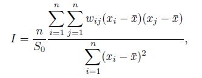
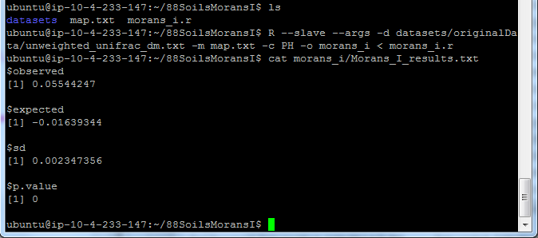
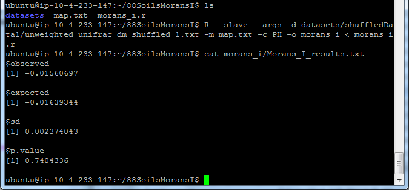
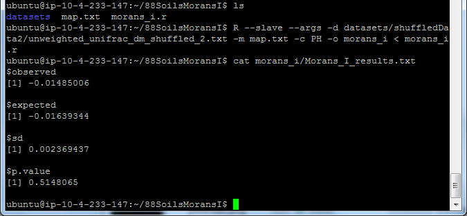
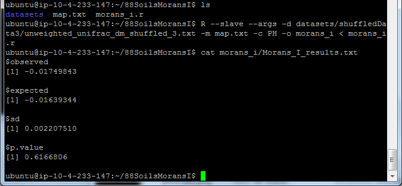

========
Morans I
========
Synopsis
--------
The Premise
^^^^^^^^^^^

Moran's I is a statistical method that takes input data that has to be numerical, and analyzes the spatial relationship between all of the samples provided in that data.

Below is an image that helps demonstrate the type of information that Morans I looks for.

.. image:: ../images/morans_i/MoransIVisualExample.gif
  :align: center

:ref:`Source<moranref6>`

The Output
^^^^^^^^^^

The output represents the spatial relationship of the samples provided. Some data should be able to fit this method in order to see if there is a relationship between the where the information was sampled. An example would be the face sites data that was obtained. If we use the top of the head as the heighest point and the chin as the lowest, we could create a way to infer the relationship of the samples based on the faces orientation in a standing position, facing forward.

It's important for the face site data that you would be explicit in defining the orientation of the data, so that you understand if you're testing from head to chin, or from tip of the nose to the nape of the neck. You would have to make sure to explicitly state which was higher or lower for the notes of testing (i.e. for the nose to the nape of the neck the nose would be highest point, and the neck would be the lowest point. The orientation of the head would be that of a person laying on their back on a flat surface with the head facing forward). This is done so that there is less of a potential to cause issues with the output.

The returned output will be between the range of -1 and 1.

If the data provided is dispersed then the observed value returned should be closer to -1.

If the data provided is clustered then the observed value returned should be closer 1. 

If the data provided returns a value near 0, then there doesn't seem to be any specific ordering to the samples provided.

Plain English
^^^^^^^^^^^^^
See above

Introduction
------------
Morans I is also known as Morans autocorrelation coefficient. It is an extension of Pearsons product moment correlation coefficient (Pearsons r), which measures the strength of linear dependence between two variables. Morans I returns a value, sometimes referred to as the I value, that shows the relationship between samples in different areas.

The Moran's I equation is:

... where wij is the weight between observation i and j, and S0 is the sum of all wij 's. Which can be seen here:

.. image:: ../images/morans_i/MoransISubVar.PNG
  :align: center

This equation returns a value between -1 and 1. The value indicates what type of correlation to expect for the data analyzed. In the case of -1 it represents perfect dispersion, where there is an equal amount of variation throughout. A positive 1 is called perfect correlation, where two points always occur together. Lastly, when you get a value closer to 0 that indicates that there is random patterning being detected.

What the null hypothesis tests for when using Morans I, is if there's no spacial correlation among communities.

Selected Implementation
-----------------------

The implementation being used is from the R software package.

The documentation for the Morans I method in R can be found :ref:`here <moranref1>`

As well as the Gittleman and Kot paper referenced from the documentation can be found :ref:`here <moranref3>`

Alternative Implementations
---------------------------

There is a matlab version of Morans I floating around. It is written by a Felix Hebeler. The last update was in October 2008 :ref:`[4] <moranref4>`.

Package sp has several functions, including moran.test, that are more specifically targeted to the analysis of spatial data. Package spatial has the function correlogram that computes and plots spatial correlograms.:ref:[`5 <moranref5>`]

System Setup and Required Dependencies
--------------------------------------
Step 1:
The first step is to install R. The following command downloads and installs R:

    sudo apt-get install r-base

Step 2:
Identify the qiime location for where it is installed. In the case of the AWS, using AMI:QIIME 1.4.0 EBS East (ami-458d5b2c). 

	QIIME location is: /software/qiime-1.4.0-release

Step 3:
You need to define an environment variable to tell the script where to look for the r utility functions in qiime. Run the following command, changing the path to point to the location of your qiime install:

    export qiime_dir=/home/<username>/qiime/trunk

If you dont want to have to perform this step each time you open a new terminal, run the following command to add it to your .bashrc:

    echo "export qiime_dir=/home/<username>/qiime/trunk" >> ~/.bashrc
    source ~/.bashrc

OR

Go into /etc/, and open the file /etc/environment. In this file youll want to put the line:

	QIIME_DIR="/software/qiime-1.4.0-release" 

The full information is:

	Directory: /etc/
	File: environment
	Full file path: /etc/environment
	String to add at bottom: QIIME_DIR="/software/qiime-1.4.0-release" 

Make sure to include the quotes. Once you do that you need to save and  restart. 

After all of this you can now type "echo $QIIME_DIR" in the terminal and it should print out the set path that was used above..

Step 4:
Youll need to install some R packages. If you can use the R console from the command line simply type R to get to it.

To get the packages type:
	install.packages(optparse)
	install.packages(ape)

If youre concerned about updating packages type "update.packages()" in the R console, excluding the quotes.

Input
-----
In order to use this method you will need the distance matrices(weighted or unweighted) and the mapping file that the information was created from. Lastly you need to select a non numerical type of data to test against. One example is date of birth.

From the command line type: 

``R --slave --args -d unifrac.txt -m Fasting_Map.txt -c DOB -o morans_i < morans_i.r``

REQUIRED options:
The following options must be provided under all circumstances.

``--slave``
    Make R run as quietly as possible. This option is intended to support programs which use R to compute results for them. It implies --quiet and --no-save. 

``--args``
    This flag does nothing except cause the rest of the command line to be skipped: this can be useful to retrieve values from it with commandArgs(TRUE).

``-i OR --input_path = INPUT_PATH``
	path to the input distance matrix file(s) (i.e., the output from beta_diversity.py).

``-o OR --output_path = OUTPUT_PATH``
	output path to the name of a single file

``-m OR --map_path = MAP_PATH``
	path to the location of the mapping file

``-c CATEGORY, --category=CATEGORY``
	String which coresponds to the column name containing grouping info

Output
------
The output of Morans I is a file that is placed in a directory specified by the -o argument. The file will be a text file with 4 values: observed, expected, sd, and p.value.

The observed value is Morans I index of x. This is computed based on the values passed in to be compared with the weights.

The expected value is the value of I under the null hypothesis.

The sd is the standard deviation of I under the null hypothesis.

P Value is the p-value of the test of the null hypothesis against the alternative hypothesis specified in alternative

Each of these values, except for the p-value, should be between -1 and 1. 

Testing Results
---------------
Testing needs to be performed further to understand the results and what I should be expecting as output. In the mean time, using the `QIIME Overview <http://qiime.org/tutorials/tutorial.html>`_ data I ran Morans I and received the following back:

===========  ===========  ===========  ===========
observed     expected     sd           p.value
===========  ===========  ===========  ===========
-0.06005486  -0.125       0.01590547   4.442088e-05
===========  ===========  ===========  ===========

I'm not especially sure how accurate this is, but it's useful to see what was received.

88 Soils (Correlation)
^^^^^^^^^^^^^^^^^^^^^^^
The data files used for this testing can be found :download:`here <../downloads/88SoilsMoransIRtesting.zip>`

In order to reproduce the results extract the files and folders, then navigate to the root directory of the extracted files and run the commands that are listed for each test.

pH Analysis (Original Data - PH)
~~~~~~~~~~~~~~~~~~~~~~~~~~~~~~~~~~~~~~~~~~~~~~
**Description:**

This data intends to analyse the differences between ph in the samples from the 88 soils data set and then to identify their correlation based on their proximity to eachother. 

This is a positive control test.

**Input:** ::

  The files provided are:

  Mapping File:
  \QiimeUtilsRepository\microbiogeo\datasets\88_soils\map.txt

  Distance Matix:
  \QiimeUtilsRepository\microbiogeo\datasets\88_soils\unweighted_unifrac_dm.txt

**Command:** ::
 
  R --slave --args -d datasets/originalData/unweighted_unifrac_dm.txt -m map.txt -c PH -o morans_i < morans_i.r

**Results:**

pH Analysis (Shuffled Data 1 - PH)
~~~~~~~~~~~~~~~~~~~~~~~~~~~~~~~~~~~~~~~~~~~~~~
**Description:**

This data intends to analyse the differences between ph in the samples from the 88 soils data set and then to identify their correlation based on their proximity to eachother. 

This is a negative control test.

**Input:** ::

  The files provided are:

  Mapping File:
  \QiimeUtilsRepository\microbiogeo\datasets\whole_body\map.txt

  Distance Matix:
  \QiimeUtilsRepository\microbiogeo\datasets\whole_body\unweighted_unifrac_dm_shuffled_1.txt

**Command:** ::
 
  R --slave --args -d datasets/shuffledData1/unweighted_unifrac_dm_shuffled_1.txt -m map.txt -c PH -o morans_i < morans_i.r
  
**Results:**

pH Analysis (Shuffled Data 2 - PH)
~~~~~~~~~~~~~~~~~~~~~~~~~~~~~~~~~~~~~~~~~~~~~~
**Description:**

This data intends to analyse the differences between ph in the samples from the 88 soils data set and then to identify their correlation based on their proximity to eachother. 

This is a negative control test.

**Input:** ::

  The files provided are:

  Mapping File:
  \QiimeUtilsRepository\microbiogeo\datasets\88_soils\map.txt

  Distance Matix:
  \QiimeUtilsRepository\microbiogeo\datasets\88_soils\unweighted_unifrac_dm_shuffled_2.txt

**Command:** ::
 
  R --slave --args -d datasets/shuffledData2/unweighted_unifrac_dm_shuffled_2.txt -m map.txt -c PH -o morans_i < morans_i.r

**Results:**

pH Analysis (Shuffled Data 3 - PH)
~~~~~~~~~~~~~~~~~~~~~~~~~~~~~~~~~~~~~~~~~~~~~~
**Description:**

This data intends to analyse the differences between ph in the samples from the 88 soils data set and then to identify their correlation based on their proximity to eachother. 

This is a negative control test.

**Input:** ::

  The files provided are:

  Mapping File:
  \QiimeUtilsRepository\microbiogeo\datasets\88_soils\map.txt

  Distance Matix:
  \QiimeUtilsRepository\microbiogeo\datasets\88_soils\unweighted_unifrac_dm_shuffled_3.txt

**Command:** ::
 
  R --slave --args -d datasets/shuffledData3/unweighted_unifrac_dm_shuffled_3.txt -m map.txt -c PH -o morans_i < morans_i.r

**Results:**

Results Analysis
----------------
Morans I accepts as input the information being analysed and the variable being used to compare the samples. Its intention is to show the correlation between the samples and their location between each other. An important nuance is that the variables being used must be numerical values. The output from Morans I returns the observed and expected value, as well as the standard deviation and the p-value. The I value returned from Morans I should be between -1 and 1. This indicates the type of spatial geography that is being observed. The output received from testing Morans I against the 88 soils data sets matched the expected out, where the p-value for the original data showed significance, and the p-value for the shuffled data were all greater than .05. Overall this is a useful method that allows for the ability to infer the spatial relationship.

References
----------
.. _moranref1:

[1]R Documentation for Morans I

``http://svitsrv25.epfl.ch/R-doc/library/ape/html/MoranI.html``

.. _moranref2:

[2]How to Work with Morans I in R

``http://www.ats.ucla.edu/stat/r/faq/morans_i.htm``

.. _moranref3:

[3]Gittleman and Kot paper

``http://www.jstor.org/pss/2992183``

.. _moranref4:

[4]Hebeler Morans I version

``http://www.mathworks.com/matlabcentral/fileexchange/13663-morans-i/content/morans_I.m``

.. _moranref5:

[5]Morans I Paper by Emmanuel Paradis

``http://cran.r-project.org/web/packages/ape/vignettes/MoranI.pdf``

.. _moranref6:

[6] Clustering and Dispersed Graphic Source

``http://edndoc.esri.com/arcobjects/9.2/net/shared/geoprocessing/spatial_statistics_tools/spatial_autocorrelation_morans_i_spatial_statistics_.htm``
