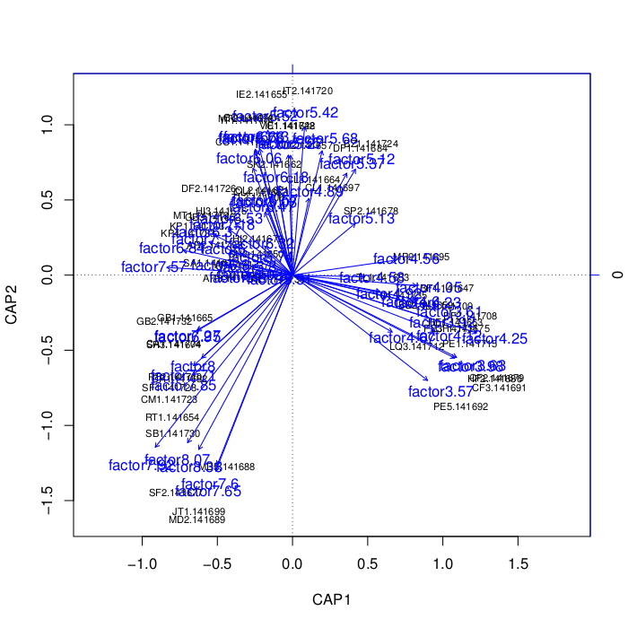
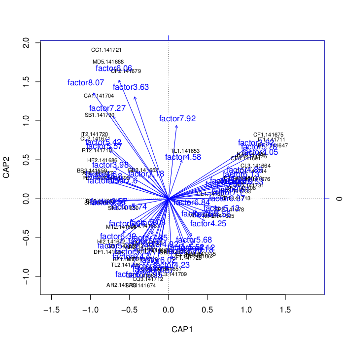
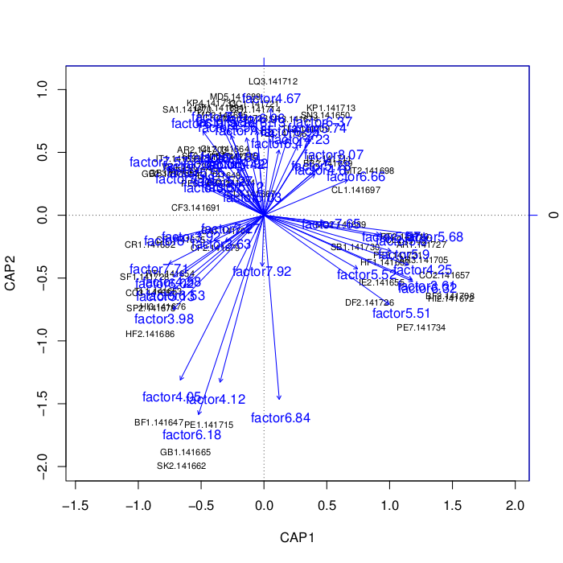

=========================
Redundancy Analysis (RDA)
=========================

Introduction
------------
Redundancy Analysis (RDA) is an ordination method similar to Canonical
Correspondence Analysis (CCA) and Principal Components Analysis (PCA) that
allows one to reduce the dimentionality of the data to something more
manageable. RDA assumes that species are linearly-related to environmental
gradients [:ref:`3 <rdaref3>`].

RDA can accept one to three matrices as input. X is the community distance
matrix that is the required input to RDA. Y is the constraining matrix
of environmental variables and is optional. It can be used to place constraints
on how variation is explained by RDA. If Y is used, it is called `constrained`
redundancy analysis. Z is the condition matrix and its effects can be removed
from X before X is processed any further. Z is also optional, and if it is used,
it is called `partial` redundancy analysis [:ref:`4 <rdaref4>`].

[:ref:`2 <rdaref2>`] (may need to be on NAU VPN to access PDF) details a very
interesting approach in what they call 'distance-based RDA', or 'DB-RDA' for
short. This method basically takes a distance matrix of any type, performs
principal coordinates analysis (PCoA) on it, corrects for negative eigenvalues,
and then performs RDA on the result and another matrix of environmental dummy
variables to analyze their relationship. This application of RDA might be the
most relevant to QIIME/microbial ecology, so it may be worth looking into.

Another paper challenges the method used in the previously described paper
[:ref:`6 <rdaref6>`]. The authors argue that the negative eigenvalue correction
step is not necessary.

:note: After meeting with our clients, it was determined that I should focus on DB-RDA rather than the other two implementations of traditional RDA since it is designed to work on a distance matrix, not a community data matrix like the others. The other two methods assume Euclidean distances, which may not always be useful for our purposes.

More research into DB-RDA yielded some more options that we might consider
including in our own implementation of the method, or at least test them out
during the evaluation phase. The first option deals with how many environmental
variables (i.e. categories in the mapping file) should be used as constraints.
The author of capscale recommends to ``not`` add too many constraining variables
because the DB-RDA ends up becoming unconstrained ordination
(e.g. PCA, CA, etc.) and you cannot perform hypothesis testing
[:ref:`8 <rdaref8>`]. He also argues that many of the constraining variables
used may end up being insignificant in their contribution to explaining
variation in samples. So should users be able to specify all environmental
variables? A large number of them? Or just one?

The second issue that might be of interest is using a second distance matrix
containing spatial distances to "partial out" the effect of spatial distance
before running DB-RDA, or to use the spatial distances as a constraining
environment variable. A series of posts details how to accomplish this using
DB-RDA [:ref:`9 <rdaref9>`]. It basically consists of running a Principal
Coordinates of Neighborhood Matrix (PCNM) over the spatial distance matrix and
using the output of that as an environment variable input to DB-RDA (can either
be a constraining variable or a partialling-out variable).

Existing Implementations
------------------------
There are existing implementations of RDA in the following statistical packages:

* XLSTAT [:ref:`1 <rdaref1>`]

* vegan package for R

* calibrate package for R

* open source R implementation by researcher [:ref:`5 <rdaref5>`]

* possibly others...

XLSTAT must be purchased and is only available on Windows and Mac OSX. The
implementations in R seems to be our best bet because it is open source and
people are already familiar with using R. There are three implementations that
I've found in R so far: vegan::rda, vegan::capscale, and calibrate::rda.

vegan::rda allows you to do partial and/or constrained RDA, while calibrate::rda
forces you to do constrained RDA. vegan::capscale is an implementation of
DB-RDA, in that it can accept a community data matrix or a distance matrix. It
allows you to decide whether you want to correct for negative eigenvalues or not
(see the discussion in the introduction section for more details on this
dispute).

I wrote a quick R script to demo vegan's capscale (DB-RDA) function on a QIIME
distance matrix. I used a series of posts [:ref:`7 <rdaref7>`] to a mailing list
as a guide for how to use capscale.

The script accepts a mapping file and a single category from the mapping file
that will be used as the constraining environmental variable (this can be
continuous, discrete, or categorical). The category will be used by capscale to
determine how much of the variability can be attributed to it. The script has
been checked into the Qiimeutils repository under :file:`microbiogeo/r/rda.r`.
The following sections of the document will explain how to set up your system to
run the script.

System Setup and Required Dependencies
--------------------------------------
:note: The following instructions have been tested on 64-bit Linux Mint (essentially Debian). However, they `should` work across different Linux distros and on Macs, though some commands may need to be tweaked, or different package names might have to be used. The instructions assume you use bash as your shell.

The first step is to install R. The following command downloaded and installed R
(for me, it was R version 2.13.1): ::

    sudo apt-get install r-base

Next, you must install the vegan and optparse packages in R. Run the following
commands: ::

    sudo R
    install.packages("vegan")
    install.packages("optparse")
    q()

The install process for the packages will prompt you to choose a mirror to
download them from. Other than that, it is completely automated. On my system, I
ended up with vegan version 2.0-2 and optparse version 0.9.4.

Next, your system must have a version of QIIME installed (I used the latest
version of QIIME in SVN). The RDA script uses some R utility functions in QIIME
to load data.

Next, you must define an environment variable to tell the RDA script where to
look for the R utility functions in QIIME. Run the following command, changing
the path to point to the location of your QIIME install: ::

    export QIIME_DIR=/home/jrideout/qiime/trunk

If you don't want to have to perform this step each time you open a new
terminal, run the following command to add it to your .bashrc: ::

    echo "export QIIME_DIR=/home/jrideout/qiime/trunk" >> ~/.bashrc
    source ~/.bashrc

Next, run the following command to test if you can run the RDA script: ::

    R --slave --args -h < rda.r

This should run the script in "help" mode. If instructions for how to run the
script are printed, you have successfully configured your system.

Input Files
-----------
The RDA script requires a distance matrix file (i.e. the result of
beta_diversity.py) and a metadata mapping file. I used the unweighted Unifrac
distance matrix and mapping file from the QIIME overview tutorial. You can get
the distance matrix
:download:`here <../downloads/overview_unweighted_unifrac_dm.txt>` and the
mapping file :download:`here <../downloads/Fasting_Map.txt>`.

Next, run the following command to execute the RDA script: ::

    R --slave --args -d overview_unweighted_unifrac_dm.txt -m Fasting_Map.txt -c Treatment < r/rda.r

Output Files
------------
The command in the previous section creates two output files named
:file:`rda_plot.pdf` and :file:`rda_results.txt`. The first file contains a 2D
plot of each of the samples. It seems very similar to the clustering shown by a
PCoA plot. The factor "Fast" overlayed on the plot is accompanied with a vector
showing what constraining factor clustered the fasting samples together. The
other output file contains information about the DB-RDA results. Notice that the
"Treatment" category accounts for 24.7% of the variability in the samples (this
information is found in the "Constrained" row of the results table).

Testing Results
---------------
This section will describe different tests that were run on the RDA script.
These tests will use empirical data from one of the several datasets that the
team has access to. These data files will not be included for download due to
their (usually) large size. Unless otherwise noted, the data files that were
used can be found under the datasets directory.

Whole Body
^^^^^^^^^^
Test 1
~~~~~~
**Description:**

This test uses the `BODY_SITE` category as a positive control. We expect to see
clustering in the resulting plot.

**Command:** ::

    R --slave --args -d datasets/whole_body/unweighted_unifrac_dm.txt -m datasets/whole_body/map.txt -c BODY_SITE < r/rda.r

**Results:**

The following output files are created: ::

    Call: capscale(formula = as.dist(qiime.data$distmat) ~ factor, data =
    factors.frame)

                   Inertia Proportion Rank
    Total         159.1762                
    Real Total    165.4413     1.0000     
    Constrained    46.0873     0.2786   19
    Unconstrained 119.3540     0.7214  371
    Imaginary      -6.2651             213
    Inertia is squared Unknown distance 

    Eigenvalues for constrained axes:
        CAP1     CAP2     CAP3     CAP4     CAP5     CAP6     CAP7     CAP8 
    14.72239 10.95891  8.89776  3.26489  2.89957  1.41151  0.87627  0.69475 
        CAP9    CAP10    CAP11    CAP12    CAP13    CAP14    CAP15    CAP16 
     0.40960  0.35446  0.29999  0.24395  0.20137  0.18342  0.17567  0.15110 
       CAP17    CAP18    CAP19 
     0.13347  0.11498  0.09327 

    Eigenvalues for unconstrained axes:
      MDS1   MDS2   MDS3   MDS4   MDS5   MDS6   MDS7   MDS8 
    12.480  5.688  4.495  3.722  3.331  2.814  2.279  2.153 
    (Showed only 8 of all 371 unconstrained eigenvalues)

.. image:: ../images/rda/whole_body_test_1.png
   :align: center

The plot shows clear clustering of fecal samples at the bottom right of the
plot. Clustering of tongue samples can also be seen at the top right, and there
is also noticable clustering of outer ear samples at the bottom left. The plot
also contains overlayed vectors indicating which body sites explain the
clustering (not sure how better to explain this).

The output text shows that the `BODY_SITE` constraining variable explains
27.86% of the variability in the samples. These results seem to fall in line
with previous results seen in PCoA plots.

Test 2
~~~~~~
**Description:**

This test uses the `SEX` category as a negative control. We don't expect to see
clustering due to previous analysis done on the Whole Body dataset.

**Command:** ::

    R --slave --args -d datasets/whole_body/unweighted_unifrac_dm.txt -m datasets/whole_body/map.txt -c SEX < r/rda.r

**Results:**

The following output file is created: ::

    Call: capscale(formula = as.dist(qiime.data$distmat) ~ factor, data =
    factors.frame)

                     Inertia Proportion Rank
    Total         159.176211                
    Real Total    165.441288   1.000000     
    Constrained     1.146286   0.006929    1
    Unconstrained 164.295002   0.993071  371
    Imaginary      -6.265078             213
    Inertia is squared Unknown distance 

    Eigenvalues for constrained axes:
     CAP1 
    1.146 

    Eigenvalues for unconstrained axes:
      MDS1   MDS2   MDS3   MDS4   MDS5   MDS6   MDS7   MDS8 
    22.935 16.207 12.165  6.875  4.970  4.167  2.915  2.809 
    (Showed only 8 of all 371 unconstrained eigenvalues)

.. image:: ../images/rda/whole_body_test_2.png
   :align: center

The plot doesn't really show clustering of samples based on sex. The output text
shows that the `SEX` constraining variable explains only 0.6929% of the
variability in the samples. These results are what we'd expect.

88 Soils
^^^^^^^^

Test 1
~~~~~~
**Description:**

This test uses the `PH` category as a positive control. We expect there to see
clustering in the resulting plot.

**Command:** ::

    R --slave --args -d datasets/88_soils/unweighted_unifrac_dm.txt -m datasets/88_soils/map.txt -c PH < r/rda.r

**Results:**

The following output file is created: ::

    Call: capscale(formula = as.dist(qiime.data$distmat) ~ factor, data =
    factors.frame)

                   Inertia Proportion Rank
    Total         15.42644    1.00000     
    Constrained   14.15581    0.91763   55
    Unconstrained  1.27063    0.08237    6
    Inertia is squared Unknown distance 

    Eigenvalues for constrained axes:
       CAP1    CAP2    CAP3    CAP4    CAP5    CAP6    CAP7    CAP8    CAP9   CAP10 
    2.72804 0.97553 0.73561 0.50872 0.44823 0.37648 0.36347 0.34511 0.32032 0.31457 
      CAP11   CAP12   CAP13   CAP14   CAP15   CAP16   CAP17   CAP18   CAP19   CAP20 
    0.29391 0.28868 0.27137 0.26067 0.24916 0.24569 0.23284 0.22594 0.22291 0.20880 
      CAP21   CAP22   CAP23   CAP24   CAP25   CAP26   CAP27   CAP28   CAP29   CAP30 
    0.20490 0.19567 0.19218 0.18870 0.18367 0.18130 0.17356 0.16801 0.16313 0.15343 
      CAP31   CAP32   CAP33   CAP34   CAP35   CAP36   CAP37   CAP38   CAP39   CAP40 
    0.15207 0.14691 0.14369 0.14033 0.13698 0.13341 0.12862 0.12829 0.12168 0.11857 
      CAP41   CAP42   CAP43   CAP44   CAP45   CAP46   CAP47   CAP48   CAP49   CAP50 
    0.11665 0.11529 0.11086 0.10414 0.10202 0.09817 0.09486 0.09310 0.09023 0.08977 
      CAP51   CAP52   CAP53   CAP54   CAP55 
    0.08588 0.07905 0.07693 0.07276 0.05491 

    Eigenvalues for unconstrained axes:
      MDS1   MDS2   MDS3   MDS4   MDS5   MDS6 
    0.3407 0.2367 0.1947 0.1780 0.1731 0.1475

The plot shows clear clustering of samples based on different levels of pH. The
output text shows that the `PH` constraining variable explains 91.763% of the
variability in the samples.

Test 2
~~~~~~
**Description:**

This test uses two shuffled distance matrices and the `PH` category to perform
three negative control tests. The third shuffled distance matrix caused the RDA
script to crash with the following error: ::

    Error in La.svd(x, nu, nv) : error code 1 from Lapack routine 'dgesdd'
    Calls: capscale -> rda.default -> svd -> La.svd -> .Call
    Execution halted

**Command:** ::

    R --slave --args -d datasets/88_soils/unweighted_unifrac_dm_shuffled_2.txt -m datasets/88_soils/map.txt -c PH < r/rda.r
    R --slave --args -d datasets/88_soils/unweighted_unifrac_dm_shuffled_3.txt -m datasets/88_soils/map.txt -c PH < r/rda.r

**Results:**

The following output files are created: ::

    Call: capscale(formula = as.dist(qiime.data$distmat) ~ factor, data =
    factors.frame)

                  Inertia Proportion Rank
    Total         15.5318     1.0000     
    Constrained   13.8340     0.8907   55
    Unconstrained  1.6978     0.1093    6
    Inertia is squared Unknown distance 

    Eigenvalues for constrained axes:
       CAP1    CAP2    CAP3    CAP4    CAP5    CAP6    CAP7    CAP8    CAP9   CAP10 
    2.51944 0.90562 0.76658 0.42333 0.41377 0.39613 0.35349 0.33536 0.32082 0.30428 
      CAP11   CAP12   CAP13   CAP14   CAP15   CAP16   CAP17   CAP18   CAP19   CAP20 
    0.27799 0.27527 0.27088 0.26178 0.25177 0.24825 0.22719 0.22067 0.21614 0.21176 
      CAP21   CAP22   CAP23   CAP24   CAP25   CAP26   CAP27   CAP28   CAP29   CAP30 
    0.20489 0.20142 0.19762 0.18876 0.18586 0.17716 0.17273 0.16968 0.16835 0.16212 
      CAP31   CAP32   CAP33   CAP34   CAP35   CAP36   CAP37   CAP38   CAP39   CAP40 
    0.15371 0.15114 0.14823 0.14430 0.13899 0.13677 0.13585 0.13203 0.12819 0.12570 
      CAP41   CAP42   CAP43   CAP44   CAP45   CAP46   CAP47   CAP48   CAP49   CAP50 
    0.12395 0.11713 0.11206 0.10648 0.10455 0.10219 0.09807 0.09546 0.08853 0.08826 
      CAP51   CAP52   CAP53   CAP54   CAP55 
    0.08473 0.08135 0.07792 0.06777 0.06153 

    Eigenvalues for unconstrained axes:
      MDS1   MDS2   MDS3   MDS4   MDS5   MDS6 
    0.5641 0.2872 0.2545 0.2455 0.1905 0.1561 

::

    Call: capscale(formula = as.dist(qiime.data$distmat) ~ factor, data =
    factors.frame)

                  Inertia Proportion Rank
    Total         15.2642     1.0000     
    Constrained   13.7485     0.9007   55
    Unconstrained  1.5157     0.0993    6
    Inertia is squared Unknown distance 

    Eigenvalues for constrained axes:
       CAP1    CAP2    CAP3    CAP4    CAP5    CAP6    CAP7    CAP8    CAP9   CAP10 
    2.32556 0.90164 0.77043 0.49428 0.42976 0.38445 0.34943 0.33868 0.31178 0.30572 
      CAP11   CAP12   CAP13   CAP14   CAP15   CAP16   CAP17   CAP18   CAP19   CAP20 
    0.29791 0.27124 0.26327 0.25333 0.24509 0.24347 0.23646 0.22955 0.21749 0.21310 
      CAP21   CAP22   CAP23   CAP24   CAP25   CAP26   CAP27   CAP28   CAP29   CAP30 
    0.20773 0.20627 0.19551 0.18697 0.18379 0.17796 0.17413 0.17256 0.16620 0.15994 
      CAP31   CAP32   CAP33   CAP34   CAP35   CAP36   CAP37   CAP38   CAP39   CAP40 
    0.15672 0.15401 0.15000 0.14340 0.14214 0.13790 0.13450 0.13187 0.12688 0.12447 
      CAP41   CAP42   CAP43   CAP44   CAP45   CAP46   CAP47   CAP48   CAP49   CAP50 
    0.11889 0.11525 0.11462 0.11083 0.10931 0.10354 0.10266 0.10067 0.09389 0.08993 
      CAP51   CAP52   CAP53   CAP54   CAP55 
    0.08892 0.08453 0.07964 0.06649 0.05380 

    Eigenvalues for unconstrained axes:
      MDS1   MDS2   MDS3   MDS4   MDS5   MDS6 
    0.4632 0.2676 0.2384 0.2090 0.1892 0.1483 

The plots show random clustering. The output text shows that the `PH`
constraining variable explains around 90% of the variability in the samples, and
I'm not sure if this is a good result or not.

References
----------
.. _rdaref1:

[1] http://www.xlstat.com/en/products-solutions/feature/redundancy-analysis-rda.html

.. _rdaref2:

[2] http://www.jstor.org/stable/pdfplus/2657192.pdf?acceptTC=true

.. _rdaref3:

[3] http://ordination.okstate.edu/glossary.htm#RDA

.. _rdaref4:

[4] R's help page for vegan::rda

.. _rdaref5:

[5] http://www.bio.umontreal.ca/legendre/indexEn.html#RFunctions

.. _rdaref6:

[6] http://www.esajournals.org/doi/abs/10.1890/0012-9658(2001)082%5B0290:FMMTCD%5D2.0.CO;2

.. _rdaref7:

[7] http://r.789695.n4.nabble.com/R-question-about-capscale-vegan-td812694.html

.. _rdaref8:

[8] http://cc.oulu.fi/~jarioksa/opetus/metodi/mmmbeam2.pdf

.. _rdaref9:

[9] http://r.789695.n4.nabble.com/partial-dbRDA-or-CCA-with-two-distance-objects-in-Vegan-td2548762.html
